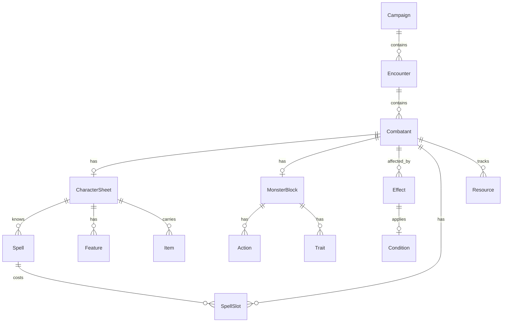
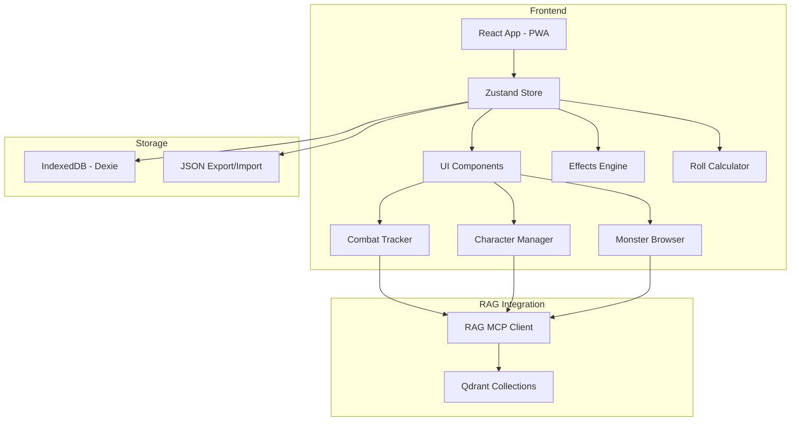
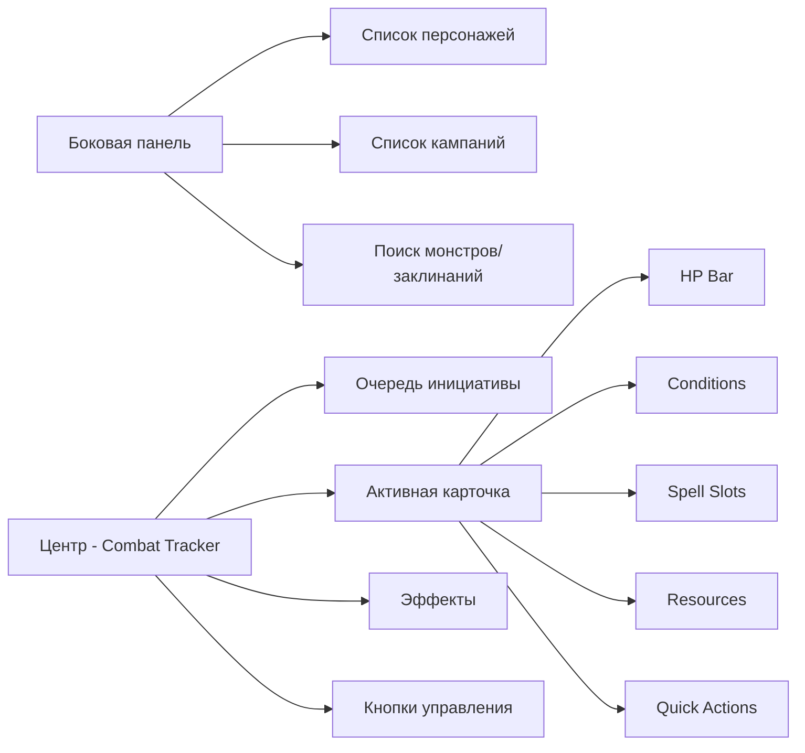

# D&D Combat Tracker — План приложения

> **Ключевое решение по времени:** В D&D боевой раунд = 6 секунд в мире игры, но в реальности ход может длиться минуты. Поэтому **никаких real-time таймеров** — все длительности отслеживаются **в раундах/ходах**:
> - "До конца следующего хода монстра" — счётчик ходов
> - "Концентрация, до 1 минуты" — 10 раундов
> - "До конца боя" — бессрочно
> - "Спасбросок в конце каждого хода" — авто-напоминание
>
> **DM-философия:** DM не вводит броски за игроков. Игроки кидают кубы у себя (вне приложения).
> DM в приложении только:
> - Отслеживает **HP, состояния, эффекты** игроков
> - Меняет **снаряжение** игроков
> - Управляет **монстрами** полностью (статблок, инициатива, атаки, урон)
> - Применяет **эффекты** и **концентрацию**
> - Использует **DM Tools** (генератор имён, d100, инициатива)
>
> **Импорт персонажей:** Приложение должно уметь импортировать JSON из **Long Story Short** — популярного приложения для ведения листов персонажей. Это решает проблему ручного ввода статистик игроков.

## 1. Анализ существующей базы знаний

### Что уже есть в RAG (Qdrant — 15 коллекций, 41,232 точки):

| Коллекция | Точек | Что содержит |
|-----------|-------|-------------|
| DndsuClasses | 1096 | 14 классов: артефактор, варвар, бард, жрец, друид, воин, монах, паладин, плут, следопыт, разбойник, чародей, колдун, волшебник |
| DndsuSpells | 1873 | 200+ заклинаний с уровнями, школами, компонентами, длительностью, концентрацией |
| DndsuMonsters | 67 | Монстры (bestiary-terms) |
| DndsuItems | 504 | Магические предметы |
| DndsuEquipment | ~200+ | Оружие, доспехи, снаряжение, инструменты |
| DndsuMechanics | 86 | Механики: заклинания, проверки способностей, мультиклассирование, языки |
| DndsuSpecies | 18 | Расы: aasimar, dragonborn, elf, warforged и др. |
| DndsuBackgrounds | — | Предыстории |
| DndsuFeats | — | Черты |
| DndsuBestiary | — | Бестиарий |
| DndsuGlossary | — | Глоссарий |
| DndsuInventory | — | Инвентарь |
| DndsuNewbie | — | Для новичков |
| DndDocs | 20 | Кампания "Shadows of the Pass" — сюжеты, NPC, квесты, локации |

### Ключевые наблюдения:
- Классы содержат полную информацию: таблицы уровней, ячейки заклинаний, очки чародейства, хиты, владения
- Заклинания содержат: уровень, школу, время сотворения, дистанцию, компоненты, длительность, концентрацию, классы, эффекты
- Монстры и бестиарий содержат CR, типы атак, урон, состояния
- Предметы содержат базовые и магические предметы с их свойствами
- Кампания содержит NPC, квесты, локации, артефакты

---

## 2. Модель данных приложения

### 2.1. Основные сущности



### 2.2. Детальная модель данных

#### Combatant (существо в бою) — лёгкая обёртка
```
{
  id: UUID,
  name: string,
  type: "player" | "monster" | "npc",
  initiative: number,
  order: number,  // для Drag & Drop: позиция в очереди, избыточно с turnOrder: UUID[], но нужна чтобы избежать полной пересортировки массива при каждой перестановке
  
  // Боевые показатели (меняются в бою)
  currentHp: number,
  maxHp: number,
  temporaryHp: number,
  armorClass: number,
  
  // Состояния и эффекты (живут в бою)
  conditions: Condition[],   // paralyzed, poisoned, prone, etc.
  effects: Effect[],          // активные эффекты заклинаний
  
  // Состояние персонажа
  deathSaves: DeathSaves | null,  // null для монстров (они просто умирают)
  exhaustion: number,              // 0-6
  
  // Групповые монстры
  isGroup: boolean,         // true для "5x Goblin"
  groupHp?: {
    individualHp: number,   // HP одной особи (например 7 для гоблина)
    totalCurrentHp: number, // текущее суммарное HP всей группы
    aliveCount: number,     // сколько живых осталось
    // Правила D&D 5e RAW:
    // - Обычная атака: урон списывается с individualHp. Если урон >= individualHp — одна особь умирает.
    //   Избыточный урон НЕ переходит на следующую особь (D&D 5e RAW).
    // - DM может целенаправленно атаковать конкретную особь: урон списывается с individualHp,
    //   остальные особи группы не получают урона.
    // - AoE: каждый участник группы получает отдельный полный урон.
    // - totalCurrentHp = aliveCount * individualHp (вычисляется, служит для быстрого визуального отображения)
  },
  
  // Ссылка на полный профиль
  profileId: UUID,
  profileType: "character" | "monster",
  
  // Заметки DM на участнике
  notes: string
}
```

#### Condition (состояние) — обновлённая версия
```
{
  id: UUID,
  name: string,  // blinded, charmed, deafened, frightened, grappled, incapacitated, invisible, paralyzed, petrified, poisoned, prone, restrained, stunned, unconscious, exhaustion
  source: string,  // название заклинания/способности/предмета
  duration: {
    // dndSourceType — оригинальный D&D-источник длительности для информации
    dndSourceType: "round" | "minute" | "hour" | "concentration" | "untilSave" | "permanent",
    // trackingType — как система отслеживает: ВСЕГДА в раундах
    // Конвертация: "1 минута" = 10 раундов, "1 час" = 600 раундов
    trackingType: "round" | "concentration" | "untilSave" | "permanent",
    remainingRounds?: number,           // сколько раундов осталось — единственный счётчик времени
    expiresOnTurnId?: UUID,             // "до конца хода монстра X"
    saveCondition?: {                   // "спасбросок в конце каждого хода"
      timing: "endOfTurn" | "startOfTurn",
      dc: number,
      ability: "str" | "dex" | "con" | "int" | "wis" | "cha",
      onSave: "remove" | "reduce" | "noEffect"
    }
  },
  description: string,
  mechanics: {  // влияние на механику
    advantage: { savingThrows?: string[], attackRolls?: string[], abilityChecks?: string[] },
    disadvantage: { savingThrows?: string[], attackRolls?: string[], abilityChecks?: string[] },
    modifiers: { ac?: number, speed?: number, attack?: number, damage?: number },
    immunities?: string[],
    vulnerabilities?: string[]
  }
}
```

#### Effect (эффект от заклинания/способности) — обновлённая версия
```
{
  id: UUID,
  name: string,  // "Haste", "Bless", "Bane"
  sourceType: "spell" | "feature" | "item",
  sourceId: string,  // ссылка на заклинание в DndsuSpells
  casterId: UUID,    // кто наложил
  targetId: UUID,    // на ком эффект
  level: number,     // уровень заклинания (для диспелла)
  
  // Длительность
  duration: Condition["duration"],  // переиспользуем тот же тип
  
  // Концентрация
  concentration: boolean,
  concentrationGroupId: UUID | null,  // группировка эффектов от одной концентрации
  // Правило: при получении урона существом, поддерживающим концентрацию,
  // требуется спасбросок Телосложения: DC = max(10, половина полученного урона).
  // При провале — все эффекты с данным concentrationGroupId снимаются.
  // При множественных источниках урона за один ход — несколько спасбросков.
  // Нельзя концентрироваться на двух заклинаниях одновременно.
  
  // Механика
  effects: Condition["mechanics"],  // модификаторы, преимущества, состояния
  description: string,
  isActive: boolean
}
```

#### Spell (заклинание)
```
{
  id: UUID,
  name: string,
  level: number,
  school: string,  // evocation, enchantment, etc.
  castTime: string,
  range: string,
  components: { verbal, somatic, material, materialCost? },
  duration: string,
  concentration: boolean,
  description: string,
  classes: string[],  // список классов, которые могут использовать
  sourceRef: string  // ссылка в коллекцию DndsuSpells
}
```

#### SpellSlot (ячейки заклинаний)
```
{
  level: 1-9,
  total: number,
  used: number,
  pactMagic: boolean  // для колдунов — слоты восстанавливаются на коротком отдыхе
}
```

#### SpellList (для мультиклассирования)
```
{
  className: string,            // "Wizard", "Cleric"
  preparedSpells: UUID[],       // ID подготовленных заклинаний
  alwaysPrepared: UUID[],       // всегда подготовленные (домены/колледжи)
  slotsContributionLevel: number,  // уровень заклинателя от этого класса
  castingAbility: "int" | "wis" | "cha",  // базовая характеристика
  spellSaveDC: number,
  spellAttackModifier: number
}
```

#### CharacterSheet (полный профиль персонажа)
```
{
  id: UUID,
  name: string,
  playerName: string,
  race: string,
  // Мультиклассирование: массив классов
  classes: {
    className: string,     // "Fighter", "Wizard"
    subClass?: string,     // "Battle Master", "Evocation"
    level: number,         // уровень в этом классе
    hitDie: string         // "d10", "d6"
  }[],
  experience: number,
  alignment: string,
  background: string,
  
  // Характеристики
  abilityScores: { str: number, dex: number, con: number, int: number, wis: number, cha: number },
  proficiencyBonus: number,
  
  // Защита
  maxHp: number,
  armorClass: number,
  speed: number,
  hitDice: { dieType: string, total: number, used: number }[],  // массив — для мультикласса, e.g. [{ dieType: "d10", total: 5, used: 2 }]
  
  // Классовые ресурсы
  resources: Resource[],
  
  // Заклинания
  spellLists: SpellList[],     // для мультиклассирования
  pactMagic: {                 // для колдунов
    spellLevel: number,        // уровень ячеек (3, 4, 5)
    slotCount: number,         // количество ячеек
  },
  
  // Снаряжение
  inventory: Item[],
  equipped: { weapon?: UUID, armor?: UUID, shield?: UUID, trinkets?: UUID[] },
  
  // Умения и черты
  skills: { [skillName]: { proficient: boolean, expertise: boolean } },
  savingThrows: { str: boolean, dex: boolean, con: boolean, int: boolean, wis: boolean, cha: boolean },
  features: string[],       // классовые умения
  feats: string[],          // черты
  
  // Прочее
  languages: string[],
  proficiencies: string[],    // владения оружием/бронёй/инструментами
  notes: string,
  
  // Источник импорта
  source: "longstoryshort" | "manual",
  sourceRef: string  // ссылка в RAG коллекцию
}
```

### 2.3. Long Story Short JSON — спецификация импорта

Long Story Short (LSS) экспортирует массив персонажей. Каждый элемент массива имеет структуру:

```json
{
  "id": "string",
  "edition": "2014" | "2024",
  "spells": { "mode": "cards", "prepared": ["id1", "id2"], "book": [] },
  "data": "{ ... }",
  "tags": [],
  "disabledBlocks": { ... }
}
```

**Парсинг `data` (JSON-строка) → CharacterSheet:**

| LSS поле | CharacterSheet поле |
|----------|---------------------|
| `name.value` | `name` |
| `info.charClass.value` | `classes[0].className` |
| `info.charSubclass.value` | `classes[0].subClass` |
| `info.level.value` | `classes[0].level` |
| `info.background.value` | `background` |
| `info.race.value` | `race` |
| `info.alignment.value` | `alignment` |
| `info.experience.value` | `experience` |
| `stats.*.score` | `abilityScores.*` |
| `proficiency` | `proficiencyBonus` |
| `vitality.hp-max.value` | `maxHp` |
| `vitality.hp-current.value` | → `Combatant.currentHp` |
| `vitality.hp-temp.value` | → `Combatant.temporaryHp` |
| `vitality.ac.value` | `armorClass` |
| `vitality.speed.value` | `speed` |
| `vitality.hit-die.value` | `classes[0].hitDie` |
| `vitality.hp-dice-current.value` | `hitDice[0].used` |
| `vitality.isDying` | → `deathSaves` |
| `vitality.deathFails` | → `deathSaves.failures` |
| `vitality.deathSuccesses` | → `deathSaves.successes` |
| `saves.*.isProf` | `savingThrows.*` |
| `skills.*.isProf` | `skills.*.proficient` |
| `spells.slots-{N}.value` | `spellLists[0].spellSlots[N]` |
| `spellsPact.slots-{N}.value` | `pactMagic.slotCount` |
| `coins.*.value` | → `inventory[].coins` |

**Особенности:**
- **Мультикласс**: LSS хранит один `charClass`. Для мультикласса нужно дополнять вручную после импорта.
- **Spell IDs**: LSS использует внутренние `_id`. Импорт заклинаний требует маппинга ID → название (через RAG или ручной ввод).
- **Pact Magic**: Отдельный объект `spellsPact` (для колдунов).
- **Death Saves**: Хранятся в `vitality` (isDying, deathFails, deathSuccesses).
- **При импорте** `data` — JSON-строка внутри верхнего объекта, требует `JSON.parse()`.

#### Action (действие)
```
type Action = {
  name: string,
  description: string,
  attackType?: "melee" | "ranged" | "spell",
  toHit?: number,
  reach?: string,
  target?: string,
  damage?: { dice: string, type: string, modifier?: string }[],
  saveDC?: { ability: string, dc: number },
  multiattack?: { actions: string[] },  // ссылка по имени
  legendaryCost?: number                // сколько legendary actions тратит
}

type Trait = {
  name: string,
  description: string,
  isPassive: boolean
}
```

#### MonsterBlock (полный профиль монстра)
```
{
  id: UUID,
  name: string,
  size: string,
  type: string,  // aberration, beast, dragon, etc.
  alignment: string,
  
  // Статы
  armorClass: number,
  maxHp: number,
  speed: { walk?: number, fly?: number, swim?: number, climb?: number, burrow?: number },
  abilityScores: { str, dex, con, int, wis, cha },
  savingThrows: { str?: number, dex?: number, ... },
  skills: { [skillName]: number },
  senses: { [senseName: string]: string },  // e.g. { darkvision: "60ft", blindsight: "30ft", tremorsense: "30ft" }
  
  // Уязвимости/иммунитеты
  damageResistances: string[],
  damageImmunities: string[],
  damageVulnerabilities: string[],
  conditionImmunities: string[],
  
  // Особенности
  traits: Trait[],        // пассивные способности
  actions: Action[],      // действия в бою
  bonusActions: Action[],
  legendaryActions: Action[],
  reactions: Action[],
  
  // Legendary Actions / Resistances
  legendaryActionCount: number,       // 3 по умолчанию
  legendaryActionUsed: number,        // сколько использовано в этом раунде
  legendaryResistanceCount: number,   // 3 по умолчанию
  legendaryResistanceUsed: number,

  // CR и опыт
  challengeRating: number,
  experience: number,
  
  // Источник
  sourceRef: string  // ссылка в RAG коллекцию
}
```

#### Resource (классовый ресурс)
```
{
  name: string,  // "Rage", "Ki Points", "Sorcery Points", "Channel Divinity", "Bardic Inspiration"
  current: number,
  max: number,
  refresh: "longRest" | "shortRest" | "special",
  description: string
}
```

#### DeathSaves
```
{
  successes: number,  // 0-3
  failures: number,   // 0-3
  stabilized: boolean,
  // Natural 1/20: специальные результаты
  // Natural 20 → stabilize + 1HP (3 successes + revived)
  // Natural 1 → 2 failures
  // Эти случаи обрабатываются в Condition Engine (B3.applyDeathSave)
}
```

#### Encounter (бой/столкновение) — владелец своих данных
```
{
  id: UUID,
  campaignId: UUID?,
  name: string,
  combatants: Combatant[],      // полные данные участников
  round: number,
  turnIndex: number,             // индекс в turnOrder
  turnOrder: UUID[],             // ТОЛЬКО ID, отсортированные по инициативе
  currentTurnCombatantId: UUID,
  status: "pending" | "active" | "paused" | "completed",
  startedAt: DateTime,
  endedAt: DateTime?,
  notes: string,
  
  // Трекер легендарных действий — счётчик использованных действий на combatant-монстра
  // Сброс legendaryActionTracker[combatantId] = MonsterBlock.legendaryActionCount
  // происходит в Engine API (tickRound / nextTurn) при начале хода монстра
  // Логика: при переходе хода на combatantId, если combatant — монстр с legendaryActionCount,
  // сбрасываем его legendaryActionTracker[combatantId] = legendaryActionCount
  legendaryActionTracker: { [combatantId: UUID]: number }
}
```

#### Campaign (кампания)
```
{
  id: UUID,
  name: string,
  description: string,
  players: CharacterSheet[],
  encounters?: Encounter[],  // опциональный кеш; источник истины — Encounter.campaignId
  notes: string,
  sourceRef: string  // ссылка на коллекцию DndDocs
}
```

---

## 3. Функциональные требования

### 3.1. Обязательные (MVP)

#### DM-only подход (броски за игроков НЕ вводятся)
- Игроки кидают кубы **сами** вне приложения
- DM **только отслеживает**: HP, временные HP, состояния, эффекты, истощение, death saves
- DM **управляет** монстрами полностью: статблок, инициатива, атаки, урон, действия
- DM **применяет** эффекты и концентрацию

#### Управление боем (Combat Tracker)
- [x] Добавление участников: игроки, монстры, NPC
- [x] Бросок инициативы (автоматический или ручной ввод)
- [x] Очередь ходов с подсветкой текущего
- [x] HP: текущие, временные, максимальные — быстрый ввод изменений
- [x] КД (Armor Class) — отображается, редактируется при необходимости
- [x] Кнопки "Next Turn" / "Previous Turn" / "End Combat"
- [x] Счётчик раундов
- [x] Состояния (Conditions): навесить/снять, с автоматическим учётом механик
- [x] Эффекты: наложение заклинаний с отслеживанием длительности (концентрация!)
- [x] Death Saves (для игроков и значимых NPC) — ввод результатов бросков от игроков
- [x] Уровень истощения (Exhaustion)
- [x] **Undo** для изменений HP и состояний (история изменений)
- [x] **Массовые действия**: применить урон/состояние к группе (например, Fireball)
- [x] **Quick damage**: быстрый ввод "12" / "12 fire" / "heal 8" / "temp 5"

#### Управление персонажами (DM-видение)
- [x] Импорт персонажа через **Long Story Short JSON** — полный разбор структуры (stats, HP, AC, класс, раса, уровень, заклинания, ячейки, снаряжение)
- [x] Просмотр листа персонажа: характеристики, класс, раса, уровень, HP, AC, скорость
- [x] Отслеживание **ячеек заклинаний** игроков (уровень, сколько осталось / всего)
- [x] Отслеживание **классовых ресурсов** (Rage, Ki, Channel Divinity, и т.д.)
- [x] Инвентарь: просмотр и редактирование снаряжения
- [x] **Экспорт в JSON** (Long Story Short совместимый формат) — чтобы игрок мог забрать обновлённый лист
- [x] Вручную создать/редактировать персонажа (резерв, если нет JSON)

#### Управление монстрами
- [x] Быстрый поиск монстров из DndsuMonsters / DndDocs / RAG
- [x] Добавление монстра в бой с автоматическим заполнением статблока
- [x] Редактирование HP монстра "на лету"
- [x] Мультиатака и действия
- [x] **Групповые монстры**: "5x Goblin" как один entry с общим HP

### 3.2. Дополнительные (можно расширять)

#### Продвинутые механики
- [ ] Авто-расчёт урона с учётом сопротивлений/иммунитетов
- [ ] Калькулятор урона: тип урона, сопротивление, уязвимость, иммунитет
- [ ] AoE: шаблоны областей, массовое применение эффектов
- [ ] Спасброски от эффектов: авто-напоминание "Спасбросок в конце хода"

#### DM Tools (повышенный приоритет — Этап 2)
- [ ] **Генератор имён**: расовые таблицы (люди, гномы, эльфы, дуэргары, дроу, орки, и т.д.)
- [ ] **d100 таблицы**: случайные эффекты, встречи, сокровища, побочные квесты
- [ ] Импорт существующих таблиц из DndDocs (dm_tools.md — уже есть d100 админка)
- [ ] **Массовые спасброски монстров**: DM кидает за монстров от заклинаний игроков

#### Визуализация
- [ ] Поле боя (grid-based или hex): позиции, передвижение
- [ ] Линии видимости (cover, obstacles)
- [ ] Ауры и радиусы эффектов

#### Интеграция с RAG
- [ ] Поиск заклинания по названию/эффекту → авто-применение
- [ ] Поиск монстра → авто-заполнение статблока
- [ ] Поиск предмета → авто-добавление в инвентарь
- [ ] Поиск правила → контекстная подсказка DM

#### Хранилище
- [ ] Локальное (LocalStorage/IndexedDB) — для одного DM
- [ ] Экспорт/импорт JSON — для переноса между сессиями
- [ ] Синхронизация через QR-код / WebRTC (опционально)

### 3.3. Что ещё можно отслеживать (brainstorm)

| Категория | Что отслеживать | Зачем |
|-----------|----------------|-------|
| **Ресурсы** | Вдохновение, Кости судьбы, Luck Points | DM может выдавать, игроки тратят |
| **Имущество** | Вес/ноша, деньги (PP/GP/SP/CP), драгоценности | Логистика, encumbrance |
| **Магия** | Заклинания в свитках, зачарованные предметы, заряды | Инвентаризация магии |
| **Прогрессия** | Опыт (XP) или Milestone, уровни, мультиклассирование | Рост персонажа |
| **Отдых** | Короткий/длинный отдых: авто-восстановление HP, ячеек, ресурсов | Ускорение рутины |
| **Логи** | История действий в бою (лог урона, исцеления, эффектов) | Откат ошибок, ревью |
| **Инициатива групп** | Группы монстров с одной инициативой | Упрощение массовых боёв |
| **Заметки** | Заметки DM по ходу боя, заметки на участниках | Контекст |
| **Состояния кастомные** | Mark, Hexblade's Curse, Hunter's Mark | Специфичные классовые эффекты |

---

## 4. Стек технологий

### 4.1. Рекомендуемый стек

| Компонент | Технология | Почему |
|-----------|-----------|--------|
| **Фронтенд** | React + TypeScript | Компонентный подход, огромная экосистема |
| **Стейт-менеджмент** | Zustand + Immer | Простота, производительность, отлично для игрового состояния |
| **Роутинг** | React Router v6 | Стандарт |
| **UI Kit** | TailwindCSS + shadcn/ui | Быстрая разработка, кастомизация |
| **Drag & Drop** | @dnd-kit | Перетаскивание в очереди инициативы |
| **Локальное хранилище** | IndexedDB (Dexie.js) | Большие объёмы, структурированные данные |
| **Сборка** | Vite | Быстрая, современная |
| **PWA** | Vite PWA plugin | Работа офлайн, установка на телефон |
| **RAG интеграция** | MCP RAG client | Поиск по существующей базе знаний |

### 4.2. Альтернативный стек (если нужна простота)

| Компонент | Технология |
|-----------|-----------|
| **Фронтенд** | Vanilla JS + HTML/CSS (одна страница) |
| **Хранилище** | LocalStorage + JSON |
| **Сборка** | Vite или вообще без сборки |

### 4.3. Архитектура приложения



### 4.4. Ключевые архитектурные решения

#### RAG Integration Bridge (MCP stdio → Browser HTTP)
MCP-сервер RAG использует stdio-транспорт, который недоступен из браузера. Решения:

1. **Вариант A (рекомендуемый для MVP): Embedded RAG client**
   - Приложение поднимает HTTP-прокси на Node.js (например, Next.js API route или Express)
   - Прокси принимает HTTP-запросы от браузера и транслирует их в MCP stdio-вызовы
   - Или: PWA работает через Tauri/Electron, которые имеют доступ к stdio

2. **Вариант B (автономный, без сервера):**
   - RAG-поиск вынести в отдельный сервис с HTTP API
   - MCP-сервер уже запущен на машине DM (в фоне)
   - Приложение обращается к нему через HTTP

3. **Вариант C (офлайн, без RAG):**
   - Кешировать результаты RAG-поиска в IndexedDB при синхронизации
   - При отсутствии RAG — работа со встроенными данными (LSS JSON, встроенные монстры)

**Рекомендация: Вариант A (HTTP-прокси) для разработки, с падбэком на Вариант C в production.**

#### Zustand ↔ Dexie Sync Protocol
```
syncProtocol = {
  // Направление: Zustand (in-memory, active combat) → Dexie (persistence)
  // И обратно: Dexie → Zustand (при загрузке кампании/энкаунтера)
  
  triggers: {
    // Каждые N секунд
    autoSave: { interval: 5000 },
    // При критических изменениях (урон, смерть, эффект)
    criticalEvents: ["damage", "death", "condition_add", "condition_remove"],
    // Ручное сохранение (Ctrl+S, кнопка Save)
    manual: true
  },
  
  // Combatant — сохраняется целиком (он лёгкий)
  // CharacterSheet / MonsterBlock — сохраняются как отдельные таблицы
  // Encounter — сохраняется структура + turnOrder (UUID[])
  
  // Конфликты: последняя запись побеждает (last-write-wins)
  // Undo хранится в Zustand (in-memory), при восстановлении — перезапись в Dexie
}
```

**Структура IndexedDB (Dexie.js):**
| Таблица | Ключ | Значение |
|---------|------|----------|
| campaigns | id | Campaign |
| characters | id | CharacterSheet |
| monsters | id | MonsterBlock |
| encounters | id | Encounter |
| combatants | id | Combatant[] (все участники энкаунтера) |
| combatLog | id | CombatLogEntry[] (история изменений) |
| ragCache | query | { results, timestamp } (кеш RAG) |

**Синхронизация в реальном времени:**
1. Пользователь взаимодействует с UI → изменяется Zustand store
2. Таймер autoSave / critical event → запись в Dexie
3. Undo: стек изменений в Zustand (in-memory), не сохраняется в Dexie
4. При загрузке энкаунтера: Dexie → Zustand (гидратация)

---

## 5. Структура файлов проекта

```
dnd-combat-tracker/
├── public/
│   ├── index.html
│   ├── manifest.json
│   └── icons/
├── src/
│   ├── main.tsx                    # Точка входа
│   ├── App.tsx                     # Корневой компонент
│   ├── routes.tsx                  # Роутинг
│   │
│   ├── stores/
│   │   ├── combatStore.ts          # Состояние боя
│   │   ├── characterStore.ts       # Персонажи
│   │   ├── encounterStore.ts       # Столкновения
│   │   └── campaignStore.ts        # Кампании
│   │
│   ├── types/
│   │   ├── combatant.ts            # Combatant, Condition, Effect
│   │   ├── character.ts            # CharacterSheet
│   │   ├── monster.ts              # MonsterBlock
│   │   ├── spell.ts                # Spell
│   │   ├── encounter.ts            # Encounter
│   │   └── campaign.ts             # Campaign
│   │
│   ├── engine/
│   │   ├── effectsEngine.ts        # Применение/снятие эффектов, концентрация
│   │   ├── rollEngine.ts           # Калькулятор бросков (d20, урон, инициатива)
│   │   ├── spellEngine.ts          # Логика заклинаний (ячейки, уровни)
│   │   ├── conditionEngine.ts      # Состояния и их влияние на механику
│   │   └── restEngine.ts           # Короткий/длинный отдых
│   │   # Полная спецификация API: docs/engine-api-spec.md
│   │
│   ├── components/
│   │   ├── CombatTracker/
│   │   │   ├── CombatTracker.tsx       # Основная панель боя
│   │   │   ├── InitiativeOrder.tsx     # Очередь инициативы
│   │   │   ├── CombatantCard.tsx       # Карточка существа в бою
│   │   │   ├── TurnControls.tsx        # Кнопки управления ходом
│   │   │   ├── RoundCounter.tsx        # Счётчик раундов
│   │   │   ├── AddCombatantDialog.tsx  # Добавление участника
│   │   │   └── EffectIndicator.tsx     # Индикаторы эффектов
│   │   │
│   │   ├── Character/
│   │   │   ├── CharacterSheet.tsx      # Лист персонажа
│   │   │   ├── AbilityScores.tsx       # Характеристики
│   │   │   ├── Skills.tsx              # Навыки
│   │   │   ├── SpellSlots.tsx          # Ячейки заклинаний
│   │   │   ├── Resources.tsx           # Классовые ресурсы
│   │   │   ├── Inventory.tsx           # Инвентарь
│   │   │   └── CharacterList.tsx       # Список персонажей
│   │   │
│   │   ├── Monster/
│   │   │   ├── MonsterBrowser.tsx      # Поиск/выбор монстра
│   │   │   ├── MonsterStatBlock.tsx    # Статблок монстра
│   │   │   └── MonsterActions.tsx      # Действия монстра
│   │   │
│   │   ├── Effects/
│   │   │   ├── ActiveEffects.tsx       # Активные эффекты
│   │   │   ├── AddEffectDialog.tsx     # Наложение эффекта
│   │   │   ├── ConditionSelector.tsx   # Выбор состояния
│   │   │   └── ConcentrationTracker.tsx # Отслеживание концентрации
│   │   │
│   │   ├── Dice/
│   │   │   ├── DiceRoller.tsx          # Броски DM: инициатива монстров, d100, d20, dmg
│   │   │   ├── RollHistory.tsx         # История бросков DM
│   │   │   └── QuickDamage.tsx         # Быстрый ввод урона/лечения (без броска)
│   │   │
│   │   ├── Search/
│   │   │   ├── SpellSearch.tsx         # Поиск заклинаний
│   │   │   ├── MonsterSearch.tsx       # Поиск монстров
│   │   │   └── ItemSearch.tsx          # Поиск предметов
│   │   │
│   │   └── Layout/
│   │       ├── Header.tsx
│   │       ├── Sidebar.tsx
│   │       └── TabBar.tsx
│   │
│   ├── hooks/
│   │   ├── useDb.ts                    # Работа с IndexedDB
│   │   ├── useRagSearch.ts             # Поиск по RAG
│   │   ├── useCombatActions.ts         # Действия в бою
│   │   └── useAutoSave.ts              # Автосохранение
│   │
│   ├── db/
│   │   ├── schema.ts                   # Схема IndexedDB
│   │   └── migrations.ts               # Миграции
│   │
│   ├── services/
│   │   ├── ragService.ts               # RAG MCP клиент
│   │   ├── importService.ts            # Импорт из базы знаний
│   │   └── exportService.ts            # Экспорт кампании
│   │
│   ├── utils/
│   │   ├── dice.ts                     # Функции для кубов
│   │   ├── constants.ts                # Константы (состояния, навыки, школы магии)
│   │   ├── formatters.ts              # Форматирование
│   │   └── helpers.ts                  # Хелперы
│   │
│   └── styles/
│       └── globals.css                 # TailwindCSS
│
├── data/
│   ├── conditions.json                 # Стандартные состояния D&D
│   ├── skills.json                     # Навыки
│   └── default-resources.json          # Классовые ресурсы по умолчанию
│
├── package.json
├── tsconfig.json
├── tailwind.config.ts
├── vite.config.ts
├── index.html
└── README.md
```

---

## 6. План реализации (этапы)

### Этап 1: Фундамент + Эффекты + LSS импорт (MVP)
1. **Создание проекта**: Vite + React + TypeScript + TailwindCSS
2. **Модели данных**: Все типы TypeScript (combatant, character, monster, spell, effect, encounter, campaign)
3. **Хранилище**: IndexedDB через Dexie.js, Zustand для стейт-менеджмента
4. **Combat Tracker (ядро)**:
   - Добавление участников (ручное/поиск)
   - Инициатива и очередь ходов (turnOrder: UUID[])
   - HP, AC, Temporary HP — быстрый ввод изменений
   - Счётчик раундов
   - Next/Previous/End turn
   - **Групповые монстры**: count, общий HP
   - **Undo**: история изменений HP и состояний
   - **Quick damage**: "12" / "12 fire" / "heal 8" / "temp 5"
   - **Hotkeys**: Space=Next Turn, D=Damage, H=Heal
5. **Система эффектов и состояний (ядро Combat Tracker)**:
   - Наложение/снятие состояний (prone, poisoned, blinded, paralyzed, unconscious)
   - Наложение/снятие эффектов заклинаний
   - Длительность в раундах (декремент при смене хода)
   - "До конца следующего хода" (expiresOnTurnId)
   - Концентрация: отслеживание, только одна, концентрацияGroupId
   - Death Saves (ввод результатов от игроков)
   - Exhaustion (0-6)
6. **Character Sheet (DM-видение)**:
   - **Импорт из Long Story Short JSON** — разбор stats, HP, AC, class, race, level, заклинания, ячейки, инвентарь
   - Просмотр листа персонажа (характеристики, навыки, ресурсы)
   - Отслеживание ячеек заклинаний (уровень, сколько осталось/всего)
   - Отслеживание классовых ресурсов (Rage, Ki, Channel Divinity)
   - Инвентарь: просмотр и редактирование
   - **Экспорт обратно в LSS JSON** — с обновлённым HP, снаряжением
   - Ручное создание/редактирование (резерв)
7. **Monster Browser (базовый)**:
   - Поиск монстра
   - Статблок монстра (AC, HP, speed, abilities, actions)
   - Добавление в бой со статблоком
   - Пресеты: "3x Goblin" одной кнопкой

### Этап 2: DM Tools (повышенный приоритет)
1. **Генератор имён**: Расовые таблицы (люди, гномы, эльфы, дуэргары, дроу, орки)
2. **d100 таблицы**: Случайные эффекты, встречи, сокровища, побочные квесты
3. **Импорт таблиц из DndDocs** (dm_tools.md — d100 админка)
4. **Dice Roller для DM**: d20, d100, урон монстров, инициатива
5. **Массовые действия**: применить эффект/урон к группе (Fireball)
6. **Спасброски монстров**: DM кидает за монстров от заклинаний игроков

### Этап 3: RAG интеграция
1. **RAG Service**: HTTP-клиент к MCP серверу
2. **Spell Search**: Поиск заклинаний → авто-применение
3. **Monster Search**: Поиск монстров → авто-заполнение
4. **Item Search**: Поиск предметов → добавление в инвентарь
5. **Кеширование**: Если RAG недоступен — работа с кешированными данными

### Этап 4: PWA и UX
1. **PWA**: Service Worker, offline support, install prompt
2. **Drag & Drop**: Перетаскивание в очереди инициативы
3. **Auto-save**: Автосохранение боя
4. **Export/Import**: JSON-экспорт кампании
5. **Rest Engine**: Короткий/длинный отдых (авто-восстановление HP, ячеек, ресурсов)
6. **Заметки DM**: на участниках боя и на энкаунтере

### Этап 5: Расширения
1. **Logs**: История действий в бою (лог урона, исцеления, эффектов)
2. **Поле боя** (опционально): Grid-визуализация с позициями и аурами
3. **Синхронизация через QR-код / WebRTC** (опционально)
4. **i18n**: Поддержка перевода (русский/английский)
5. **Unit-тесты**: На систему эффектов и состояния

---

## 7. Ключевые UX решения

### 7.1. Основной экран — Combat Tracker


### 7.2. Основной сценарий использования
1. DM открывает приложение → видит список кампаний
2. Выбирает кампанию → открывается последний активный бой (или пустой)
3. Нажимает "Add Combatant" → ищет монстра по RAG или выбирает игрока
4. Добавляет всех участников, вводит инициативу
5. Начинает бой → очередь ходов, счётчик раундов
6. На каждом ходу: ввод урона, наложение эффектов, снятие эффектов, отслеживание ресурсов
7. По окончании: End Combat → бой сохраняется в историю кампании

---

## 8. Что делает это приложение уникальным

1. **Интеграция с RAG**: Заполнение статблоков и поиск правил прямо из базы знаний
2. **Автоматизация механик**: Эффекты сами меняют AC, скорость, спасброски
3. **Концентрация**: Автоматическое отслеживание и снятие при получении урона
4. **Офлайн-first**: PWA, вся логика на клиенте, данные в IndexedDB
5. **DM-ориентированность**: Быстрый ввод, минимальное количество кликов

---

## 9. Критический анализ плана (результаты проверки)

### 9.1. Проблемы модели данных

| Проблема | Описание | Решение |
|----------|----------|---------|
| **Combatant перегружен** | В одну структуру свалены и боевые характеристики, и ресурсы, и ячейки, и позиция | Убрать тяжелые поля (abilityScores, savingThrows, skills, hitDice, spellSlots, resources), оставить только боевые. `conditions`, `effects`, `deathSaves`, `exhaustion` остаются в Combatant — они требуются в бою и невелики по размеру. `profileId: UUID` + `profileType: character \| monster` ссылаются на отдельные сущности. |
| **Encounter.turnOrder дублирует combatants** | Два массива одних и тех же объектов — рассинхронизация при изменениях | Хранить `turnOrder: UUID[]` — только ID участников, сортированные по инициативе. |
| **Нет групповых монстров** | 20 гоблинов = 20 отдельных записей в очереди | Добавить `isGroup: boolean` и `count: number`. HP считается как count x hp. |
| **Мультиклассирование** | Ячейки заклинаний считаются от одного класса, но при мультиклассе они общие | Разделить `spellSlots` общие и `spellLists: { className, preparedSpells[], slotsContributionLevel }[]` |
| **Duration слишком простой** | Нет "до конца следующего хода" и "спасбросок каждый ход" | Добавить `expiresOnTurnId`, `saveCondition: { timing, dc, ability, onSave }` |
| **Концентрация не группирует эффекты** | Одно заклинание может давать несколько эффектов, снимать нужно все сразу | `concentrationGroupId: UUID` — все эффекты группы снимаются вместе |

### 9.2. UX-пробелы

| Проблема | Важность | Решение |
|----------|----------|---------|
| **Нет Undo** | Критическая | История изменений combatStore, Ctrl+Z |
| **Медленный ввод урона** | Высокая | Quick damage парсер: "12" \| "12 fire" \| "12 fire half" |
| **Нет массовых действий** | Высокая | Выбрать группу -> кинуть спасброски / нанести урон |
| **Мёртвые в очереди** | Средняя | Unconscious/Dead -> вниз списка автоматически |
| **Нет Hotkeys** | Средняя | Space = Next Turn, D = Damage, H = Heal |
| **Нет пресетов монстров** | Средняя | "3x Goblin" одной кнопкой |

### 9.3. Исправленные несостыковки (после повторной валидации)

Следующие проблемы были найдены и исправлены:

| Проблема | Где было | Исправление |
|----------|----------|-------------|
| Combatant не соответствовал критике | Секция 2.2 | Переписан: лёгкая обёртка с profileId, вынесены abilityScores, savingThrows, skills, hitDice, spellSlots, resources, position, sourceRef. conditions и effects остались (требуются в бою и невелики по размеру) |
| Duration без saveCondition | Секция 2.2 | Добавлен expiresOnTurnId, saveCondition, untilSave, permanent |
| Нет concentrationGroupId | Секция 2.2 | Добавлен в Effect |
| Нет групповых монстров | Секция 2.2 | Добавлены isGroup, count |
| Нет мультиклассирования | Секция 2.2 | Добавлены CharacterSheet, SpellList, MonsterBlock |
| Нет DeathSaves структуры | Секция 2.2 | Добавлен отдельный тип |
| LSS импорт в "дополнительных" | Секция 3.2 | Перенесён в MVP 3.1, дубликат удалён |
| Этапы не соответствовали критике | Секция 6 | Эффекты, концентрация, LSS импорт — в Этап 1. DM Tools — в Этап 2 |
| DM Tools в самом конце | Секция 6 | Подняты в Этап 2 (повышенный приоритет) |
| Пример LSS JSON упрощён | Секция 3.2 | Секция удалена (уже в 3.1 как MVP) |
| **A1. Combatant: согласовать 9.1, 9.3, 2.2** | Секция 9.1 | **Решение: A1b** — `conditions` и `effects` остаются в Combatant. Секция 9.1 обновлена: убрана рекомендация выносить их. |
| **A2. Combatant.order — документировать** | Секция 2.2 | Добавлен комментарий: `// для Drag & Drop: позиция в очереди, избыточно с turnOrder: UUID[], но нужна чтобы избежать полной пересортировки массива при каждой перестановке` |
| **A3. Group monster: HP model** | Секция 2.2 | Заменено `count: number` на `groupHp: { individualHp, currentPool, aliveCount }` с правилами D&D 5e RAW |
| **A4. Мультиклассирование** | Секция 2.2 | `class/subClass/level` → `classes[]`; `hitDice` → массив с `used` |
| **A5. Action type — определить** | Секция 2.2 | Добавлены `type Action` и `type Trait` перед MonsterBlock |
| **A6. Dual-ownership** | Секция 2.2 | **Решение: Опция 2** — Encounter — владелец (campaignId в Encounter). Campaign.encounters — опциональный кеш. |
| **A7. Hit Dice — add used** | Секция 2.2 | Покрыто A4: `hitDice: { dieType, total, used }[]` |
| **A8. Legendary Actions/Resistances** | Секция 2.2 | Добавлены `legendaryActionCount/Used`, `legendaryResistanceCount/Used` в MonsterBlock; `legendaryActionTracker` в Encounter |
| **B1. Concentration API** | Секция 5 | Специфицирован `checkConcentration()`, UI-протокол, авто-снятие. См. [`plans/engine-api-spec.md`](plans/engine-api-spec.md#b1-concentration-api) |
| **B2. Effects Engine API** | Секция 5 | 9 методов: applyEffect, removeEffect, removeConcentrationGroup, tickRound, onDamageTaken, getStatModifiers, getEffects, hasConcentration, getActiveConcentrations. См. [`plans/engine-api-spec.md`](plans/engine-api-spec.md#b2-effects-engine-api) |
| **B3. Condition Engine API** | Секция 5 | 7 методов: applyCondition, removeCondition, hasCondition, getConditionModifiers, getAutoEffects, clearConditions, applyDeathSave. См. [`plans/engine-api-spec.md`](plans/engine-api-spec.md#b3-condition-engine-api) |
| **B4. Roll Engine API** | Секция 5 | 8 методов: rollInitiative, rollGroupInitiative, setPlayerInitiative, buildTurnOrder, addMidCombat, rollDamage, rollD20, rollD100. См. [`plans/engine-api-spec.md`](plans/engine-api-spec.md#b4-roll-engine-api) |
| **B5. Save Condition auto-reminder** | Секция 5 | Специфицирован `SaveReminder` тип и механизм работы. См. [`plans/engine-api-spec.md`](plans/engine-api-spec.md#b5-save-condition-auto-reminder) |

### 9.4. Технические замечания

- **Работа без RAG**: Если MCP-сервер недоступен, приложение должно работать с кешированными данными
- **Тесты**: Система эффектов требует unit-тестов (сложная логика)
- **i18n**: База на русском, но архитектуру закладывать с поддержкой перевода
- **Сценарий "монстры кидают спасброски"**: Не был учтён в UX-сценарии — добавлен в Этап 2 и DM Tools
- **Hotkeys**: Space, D, H — добавлены в Этап 1
- **Undo**: Добавлен в Этап 1 — критично для DM