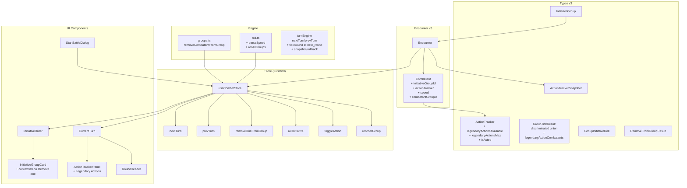

# Track C: Initiative Groups + Action Economy

> **Назначение:** Полная спецификация новой системы групповой инициативы и отслеживания action economy для D&D Combat Tracker.
> **Основание:** Замена плоского `turnOrder: UUID[]` на иерархическую систему `InitiativeGroup[]` с групповыми бросками инициативы и трекингом Action/Bonus Action/Reaction/Movement.
> **Статус:** Утверждён (v2.0 — исправлены блокеры и критические замечания из [`track-c-validation.md`](track-c-validation.md)).

---

## 1. Новые типы данных

### 1.1. `InitiativeGroup` — группа инициативы

```typescript
// types/index.ts

export interface InitiativeGroup {
  id: UUID;
  name: string;                    // "Players", "Monsters", "Goblin Squad"
  type: 'players' | 'monsters' | 'allies' | 'npc';
  initiative: number;              // общий бросок d20 + модификатор группы
  initModifier: number;            // модификатор инициативы группы (среднее арифметическое бонусов участников, округлённое вверх)
  initMode: 'group' | 'individual'; // ← НОВОЕ: group = общая инициатива, individual = каждый сам за себя
  combatantIds: UUID[];            // участники группы (ссылки на Combatant.id)
  currentOrder: UUID[];            // порядок хода ВНУТРИ группы в ЭТОМ раунде
  currentIndex: number;            // индекс текущего ходящего внутри currentOrder
  isActive: boolean;               // false если группа побеждена/удалена
}
```

> **Важно:** `currentOrder` содержит ID каждого отдельного Combatant'а. Для группы монстров (5x Goblin) это 5 отдельных Combatant ID с одинаковым `groupId` и `initiativeGroupId`. Каждый Combatant в группе имеет свой `currentHp` и `actionTracker`.

### 1.2. `ActionTracker` — трекинг действий

```typescript
// types/index.ts

export interface ActionTracker {
  action: boolean;       // true = потрачено
  bonusAction: boolean;  // true = потрачено
  reaction: boolean;     // true = потрачено
  movement: number;      // сколько ft уже потрачено из скорости
  movementSpeed: number; // базовая скорость в ft (берётся из Combatant.speed)

  // Legendary Actions (опционально, только для монстров с legendary)
  legendaryActionsAvailable: number;  // сколько осталось в этом раунде
  legendaryActionsMax: number;        // максимум в раунд (обычно 3)

  // Monster simplification (опционально)
  isActed: boolean;       // true = монстр уже действовал в этом раунде
}
```

### 1.3. Изменения в `Encounter`

```typescript
// Текущее (v1):
export interface Encounter {
  id: UUID;
  name: string;
  campaignId: UUID | null;
  combatants: Combatant[];
  round: number;
  turnIndex: number;          // УДАЛЯЕТСЯ в v3
  turnOrder: UUID[];          // УДАЛЯЕТСЯ в v3
  isActive: boolean;
  startTime: number;
  environment: string;
  notes: string;
}

// Новое (v3):
export interface Encounter {
  id: UUID;
  name: string;
  campaignId: UUID | null;
  combatants: Combatant[];
  initiativeGroups: InitiativeGroup[];  // ← НОВОЕ
  currentGroupId: UUID | null;          // ← НОВОЕ: какая группа ходит сейчас
  groupTurnIndex: number;               // ← НОВОЕ: индекс группы в initiativeGroups (для next/prev)
  round: number;
  isActive: boolean;
  startTime: number;
  environment: string;
  notes: string;

  // @deprecated — удалены в v3
  // turnIndex: number;
  // turnOrder: UUID[];
}
```

### 1.4. Изменения в `Combatant`

```typescript
// Добавить в Combatant:
export interface Combatant {
  // ... все существующие поля ...
  initiativeGroupId: UUID | null;  // ← НОВОЕ: ссылка на InitiativeGroup.id
  actionTracker: ActionTracker;    // ← НОВОЕ: трекинг действий в этом раунде
  speed: number;                   // ← НОВОЕ: скорость в ft (для movement tracking)
  combatantGroupId: UUID | null;   // ← НОВОЕ: для групповых монстров (5x Goblin), общий ID
  combatantGroupSize: number;      // ← НОВОЕ: сколько всего в группе монстров
  combatantGroupIndex: number;     // ← НОВОЕ: индекс этого конкретного монстра (0..groupSize-1)
}
```

> **Изменение модели группы монстров:** Вместо одного `Combatant` с `isGroup: true` и `groupSize: 5`, теперь создаётся **5 отдельных Combatant'ов** с общим `combatantGroupId`. Каждый имеет свой `currentHp = individualHp`, свой `actionTracker`, свой `id`. Все они ссылаются на один `InitiativeGroup` через `initiativeGroupId`.

**Поля, которые УДАЛЯЮТСЯ из Combatant:**
- `isGroup: boolean` — заменено на `combatantGroupId`
- `groupSize: number` — заменено на `combatantGroupSize`
- `individualHp: number` — заменено на `currentHp` каждого отдельного Combatant'а

### 1.5. Вспомогательные типы

```typescript
// types/index.ts

// Discriminated union для строгой типизации GroupTickResult
export type GroupTickResult =
  | {
      type: 'next_combatant';
      previousGroupId: UUID | null;
      currentGroupId: UUID | null;
      previousCombatantId: UUID | null;
      currentCombatantId: UUID | null;
      round: number;
      tickResult: null;
      legendaryActionCombatants: UUID[];  // монстры с доступными Legendary Actions
    }
  | {
      type: 'next_group';
      previousGroupId: UUID | null;
      currentGroupId: UUID | null;
      previousCombatantId: UUID | null;
      currentCombatantId: UUID | null;
      round: number;
      tickResult: null;
      legendaryActionCombatants: UUID[];
    }
  | {
      type: 'new_round';
      previousGroupId: UUID | null;
      currentGroupId: UUID | null;
      previousCombatantId: UUID | null;
      currentCombatantId: UUID | null;
      round: number;
      tickResult: TickResult;  // только при new_round
      legendaryActionCombatants: UUID[];
    }
  | {
      type: 'combat_end';
      previousGroupId: UUID | null;
      currentGroupId: UUID | null;
      previousCombatantId: UUID | null;
      currentCombatantId: UUID | null;
      round: number;
      tickResult: null;
      legendaryActionCombatants: [];
    }
  | {
      type: 'legendary_action_opportunity';
      previousGroupId: UUID | null;
      currentGroupId: UUID | null;
      previousCombatantId: UUID | null;
      currentCombatantId: UUID | null;
      round: number;
      tickResult: null;
      legendaryActionCombatants: UUID[];  // кто может использовать Legendary Action
    };

// Результат rollInitiative для групп
export interface GroupInitiativeRoll {
  groupId: UUID;
  groupName: string;
  roll: number;           // результат d20
  modifier: number;       // модификатор
  total: number;          // roll + modifier
  manual: boolean;        // true если DM выставил вручную
}

// Параметры для старта боя с группами
export interface StartBattleParams {
  name: string;                         // Encounter name
  environment?: string;                 // Encounter environment
  notes?: string;                       // Encounter notes
  groups: {
    name: string;
    type: InitiativeGroup['type'];
    combatantIds: UUID[];
    initiative?: number;       // опционально — если DM уже выставил
    initModifier?: number;     // опционально — модификатор группы
    initMode?: 'group' | 'individual';  // ← НОВОЕ: group = общая инициатива, individual = каждый сам за себя
  }[];
}

// RemoveFromGroupResult — результат удаления одного существа из группы
export interface RemoveFromGroupResult {
  updatedEncounter: Encounter;
  removedCombatant: Combatant;
  groupSurvivors: Combatant[];   // оставшиеся члены группы
  groupDeleted: boolean;         // true если группа полностью удалена
  newCurrentGroupId: UUID | null;  // скорректированный currentGroupId
}
```

---

## 1.6. Удаление одного существа из группы (RemoveFromGroup)

### Проблема

В старой модели `isGroup` с `groupSize: number` — одна запись Combatant на N существ. Нельзя удалить одного гоблина, не удаляя всю группу.

### Решение

Группа монстров (например, "5x Goblin") создаётся как **массив индивидуальных Combatant'ов** с общим `combatantGroupId`. Каждый гоблин — отдельный Combatant со своим HP, условиями, action tracker'ом. Все они входят в один `InitiativeGroup` через `initiativeGroupId`.

### Функция: `removeCombatantFromGroup()`

```typescript
// engine/groups.ts

function removeCombatantFromGroup(
  encounter: Encounter,
  combatantId: UUID
): RemoveFromGroupResult {
  // 1. Найти combatant'а
  const combatant = encounter.combatants.find(c => c.id === combatantId);
  if (!combatant) throw new Error(`Combatant ${combatantId} not found`);

  // 2. Найти группу монстров (combatantGroupId)
  const groupId = combatant.combatantGroupId;
  let groupSurvivors: Combatant[] = [];
  let groupDeleted = false;

  if (groupId) {
    // Это член группы монстров — удаляем только его
    groupSurvivors = encounter.combatants.filter(
      c => c.combatantGroupId === groupId && c.id !== combatantId
    );
    // Обновляем combatantGroupSize у выживших
    groupSurvivors = groupSurvivors.map((c, i) => ({
      ...c,
      combatantGroupSize: groupSurvivors.length,
      combatantGroupIndex: i,
    }));
    groupDeleted = groupSurvivors.length === 0;
  }

  // 3. Удалить combatant из encounter
  const remainingCombatants = encounter.combatants.filter(c => c.id !== combatantId);
  // Если это была группа, заменяем обновлёнными survivor'ами
  const finalCombatants = groupId
    ? remainingCombatants.map(c =>
        groupSurvivors.find(s => s.id === c.id) ?? c
      )
    : remainingCombatants;

  // 4. Удалить combatant из InitiativeGroup
  let updatedGroups = encounter.initiativeGroups.map(g => ({
    ...g,
    combatantIds: g.combatantIds.filter(id => id !== combatantId),
    currentOrder: g.currentOrder.filter(id => id !== combatantId),
  }));

  // 5. Удалить пустые группы
  const nonEmptyGroups = updatedGroups.filter(g => g.combatantIds.length > 0);
  const wasGroupDeleted = updatedGroups.length !== nonEmptyGroups.length;
  groupDeleted = groupDeleted || wasGroupDeleted;

  // 6. Скорректировать currentGroupId (Blocker 2 fix)
  let newCurrentGroupId = encounter.currentGroupId;
  if (groupDeleted || !nonEmptyGroups.find(g => g.id === encounter.currentGroupId)) {
    // Текущая группа удалена — перейти к следующей активной
    const currentGroupIndex = nonEmptyGroups.findIndex(g => g.id === encounter.currentGroupId);
    if (currentGroupIndex !== -1 && currentGroupIndex < nonEmptyGroups.length - 1) {
      newCurrentGroupId = nonEmptyGroups[currentGroupIndex + 1].id;
    } else if (nonEmptyGroups.length > 0) {
      newCurrentGroupId = nonEmptyGroups[0].id;
    } else {
      newCurrentGroupId = null; // combat end
    }
  }

  // 7. Скорректировать currentIndex внутри группы
  const affectedGroup = nonEmptyGroups.find(g => g.id === newCurrentGroupId);
  if (affectedGroup && affectedGroup.currentIndex >= affectedGroup.currentOrder.length) {
    affectedGroup.currentIndex = Math.max(0, affectedGroup.currentOrder.length - 1);
  }

  const updatedEncounter: Encounter = {
    ...encounter,
    combatants: finalCombatants,
    initiativeGroups: nonEmptyGroups,
    currentGroupId: newCurrentGroupId,
  };

  return {
    updatedEncounter,
    removedCombatant: combatant,
    groupSurvivors,
    groupDeleted,
    newCurrentGroupId,
  };
}
```

### UI Flow: Remove one creature from group

```
[DM видит "5x Goblin" в InitiativeGroupCard]
        │
        ▼
[DM нажимает правой кнопкой / context menu на одном гоблине]
        │
        ├── [Remove from group] → вызывает removeCombatantFromGroup()
        │       │
        │       ▼
        │   Один гоблин удалён, остальные 4 остаются
        │   InitiativeGroupCard показывает "4x Goblin"
        │   Все 4 оставшихся гоблина имеют обновлённый combatantGroupSize: 4
        │
        ├── [Remove all from group] → вызывает removeCombatant() для каждого
        │       │
        │       ▼
        │   Вся группа удалена, InitiativeGroup удалена
        │
        └── [Damage] → применяется к конкретному гоблину
```

---

## 2. Turn Engine API (C1)

### 2.1. `turnEngine.getCurrentCombatant()`

```typescript
getCurrentCombatant(encounter: Encounter): Combatant | null
```

**Логика:**
1. Найти группу по `encounter.currentGroupId`
2. Если группа есть:
   a. Получить `currentCombatantId = group.currentOrder[group.currentIndex]`
   b. Если combatant мёртв — автоматически пропустить (аналогично существующей логике в store.ts skip dead)
   c. Вернуть combatant'а
3. Если нет — вернуть `null`

**Auto-skip dead combatants внутри группы:**
```typescript
function getCurrentCombatant(encounter: Encounter): Combatant | null {
  const group = encounter.initiativeGroups.find(g => g.id === encounter.currentGroupId);
  if (!group) return null;

  let safety = 0;
  while (safety < group.currentOrder.length) {
    const combatantId = group.currentOrder[group.currentIndex];
    const combatant = encounter.combatants.find(c => c.id === combatantId);
    if (combatant && !combatant.isDead && combatant.currentHp > 0) {
      return combatant;
    }
    // Skip dead
    group.currentIndex = (group.currentIndex + 1) % group.currentOrder.length;
    safety++;
  }
  return null; // все мертвы в группе
}
```

### 2.2. `turnEngine.nextTurn()`

```typescript
nextTurn(encounter: Encounter): {
  updatedEncounter: Encounter;
  result: GroupTickResult;
}
```

**Логика:**
1. **Snapshot:** Сохранить текущее состояние `ActionTracker` для `prevTurn()` (см. секцию 2.2a)
2. Получить текущую группу по `currentGroupId`
3. Инкрементировать `group.currentIndex`
4. Если `currentIndex < currentOrder.length`:
   - Сбросить `ActionTracker` у нового combatant'а (action/ba/reaction = false, movement = 0)
   - Сбросить `legendaryActionsAvailable` для монстров с legendary actions (в начале их хода)
   - Вернуть `{ type: 'next_combatant', ... }`
5. Если `currentIndex >= currentOrder.length` (группа закончилась):
   - Инкрементировать `encounter.groupTurnIndex`
   - Найти следующую активную группу (с живыми combatant'ами)
   - Если следующая группа найдена:
     - Сбросить её `currentIndex` до 0
     - Сбросить `isActed` для всех монстров в группе, если isActed используется
     - Обновить `currentGroupId`
     - Вернуть `{ type: 'next_group', ... }`
   - Если групп больше нет (все прошли) → **новый раунд**:
     - Инкрементировать `round`
     - Сбросить `groupTurnIndex` до 0
     - Для каждой группы: сбросить `currentIndex` до 0
     - Пересортировать группы по initiative (только если initiative менялась)
     - **Вызвать `tickRound()` для всех эффектов** (см. Critical 4 fix)
     - Вернуть `{ type: 'new_round', ... }` с `tickResult`
6. Если все combatant'ы мертвы → `{ type: 'combat_end', ... }`

**Сброс ActionTracker происходит в начале хода каждого индивидуального combatant'а**, а не при старте группы. Это соответствует D&D 5e RAW: "At the start of a creature's turn, it regains its action and bonus action."

### 2.2a. Snapshot/Rollback для ActionTracker (Critical 2 fix)

```typescript
// Snapshot — сохраняется в Encounter перед каждым nextTurn()
export interface ActionTrackerSnapshot {
  combatantId: UUID;
  actionTracker: ActionTracker;
  timestamp: number;  // для отладки
}

// Добавить в Encounter:
export interface Encounter {
  // ... остальные поля ...
  actionTrackerHistory: ActionTrackerSnapshot[];  // ← НОВОЕ: история для prevTurn()
}
```

**Механизм:**
1. В `nextTurn()` перед изменением `currentIndex`:
   ```typescript
   // Сохранить snapshot текущего combatant'а
   const currentCombatant = getCurrentCombatant(encounter);
   if (currentCombatant) {
     encounter.actionTrackerHistory.push({
       combatantId: currentCombatant.id,
       actionTracker: { ...currentCombatant.actionTracker },
       timestamp: Date.now(),
     });
   }
   // Ограничить историю (только последний раунд)
   if (encounter.actionTrackerHistory.length > 100) {
     encounter.actionTrackerHistory = encounter.actionTrackerHistory.slice(-50);
   }
   ```

2. В `prevTurn()`:
   ```typescript
   // Восстановить snapshot
   const snapshot = encounter.actionTrackerHistory.pop();
   if (snapshot) {
     const combatant = encounter.combatants.find(c => c.id === snapshot.combatantId);
     if (combatant) {
       combatant.actionTracker = snapshot.actionTracker;
     }
   }
   // Декрементировать currentIndex, вернуться к предыдущему
   ```

### 2.3. `turnEngine.prevTurn()`

```typescript
prevTurn(encounter: Encounter): {
  updatedEncounter: Encounter;
  result: GroupTickResult;
}
```

**Логика:**
1. **Восстановить snapshot** ActionTracker для текущего combatant'а (из `actionTrackerHistory`)
2. Декрементировать `group.currentIndex`
3. Если `currentIndex >= 0` — вернулись внутри группы
4. Если `currentIndex < 0` — перейти к предыдущей группе:
   - Декрементировать `encounter.groupTurnIndex`
   - Найти предыдущую активную группу
   - Установить её `currentIndex` на последний элемент `currentOrder`
5. Если групп впереди нет — `currentIndex = 0` первой группы

### 2.4. `turnEngine.getGroupForCombatant()`

```typescript
getGroupForCombatant(encounter: Encounter, combatantId: UUID): InitiativeGroup | null
```

### 2.5. `turnEngine.getCombatantsInGroup()`

```typescript
getCombatantsInGroup(encounter: Encounter, groupId: UUID): Combatant[]
```

### 2.6. `turnEngine.reorderGroup()`

```typescript
reorderGroup(encounter: Encounter, groupId: UUID, newOrder: UUID[]): Encounter
```

**Логика:** DM перетасовывает `currentOrder` внутри группы (Drag & Drop). `combatantIds` не меняется — только порядок хода в этом раунде. В следующем раунде `currentOrder` сбрасывается до `combatantIds` (или можно сохранить порядок, если DM не менял).

### 2.7. `turnEngine.resetActionTracker()`

```typescript
resetActionTracker(combatant: Combatant): Combatant
```

**Логика:** Устанавливает `actionTracker.action = false`, `actionTracker.bonusAction = false`, `actionTracker.reaction = false`, `actionTracker.movement = 0`. Для монстров: `actionTracker.isActed = false`.

### 2.8. `turnEngine.useAction()`

```typescript
useAction(combatant: Combatant, type: 'action' | 'bonusAction' | 'reaction' | 'legendary', amount?: number): Combatant
```

**Логика:**
- `action` / `bonusAction` / `reaction`: устанавливает флаг в `true`
- `movement`: добавляет `amount` к `actionTracker.movement`, проверяет что не превышает `actionTracker.movementSpeed`
- `legendary`: декрементирует `actionTracker.legendaryActionsAvailable`

---

## 3. Roll Engine API (C2) — дополнение к B4

### 3.1. `rollEngine.rollGroupInitiative()` — обновлённая

```typescript
rollGroupInitiative(group: {
  combatants: Combatant[];
  initModifier: number;
}): number
```

**Логика:** Один бросок `d20 + initModifier` на всю группу. Все участники группы получают одинаковую инициативу.

**Как вычисляется `initModifier` группы (новые правила):**

1. **Для монстров в одной группе** (например, `3x Goblin + 2x Hobgoblin` в группе "Goblin Squad"):
   - Берём **среднее арифметическое** бонусов к инициативе всех участников группы
   - **Округляем вверх** (`Math.ceil()`)
   - *Пример:* Goblin Dex +2, Hobgoblin Dex +1 → среднее (2+2+2+1+1)/5 = 1.6 → `initModifier = 2`

2. **Для игроков в группе "Players"** (если `initMode === 'group'`):
   - Каждый игрок имеет свой бонус к инициативе (из `CharacterSheet.initiative`)
   - Берём **среднее арифметическое** бонусов всех игроков в группе
   - **Округляем вверх** (`Math.ceil()`)
   - *Пример:* Rogue +5, Wizard -1, Cleric +2 → среднее (5-1+2)/3 = 2.0 → `initModifier = 2`

3. **Для союзников/NPC**:
   - DM выставляет вручную. Если не указан — среднее арифметическое по тому же правилу.

**Важно:** `initModifier` всегда настраиваемый — DM может переопределить авторасчёт в `StartBattleDialog`.

### 3.1a. `initMode` — переключатель режима инициативы группы

У каждой `InitiativeGroup` есть поле `initMode: 'group' | 'individual'`.

**`initMode === 'group'` (по умолчанию):**
- Один бросок `d20 + initModifier` на всю группу
- Все участники ходят по общей инициативе
- `currentOrder` определяет порядок ВНУТРИ группы

**`initMode === 'individual'`:**
- Каждый участник группы кидает инициативу индивидуально (своим бонусом)
- Группа **разворачивается** в плоский список: каждый combatant получает свой `initiative` и вставляется в `InitiativeGroup.currentOrder` по своей инициативе
- Участники всё ещё принадлежат к одной `InitiativeGroup`, но их инициативы могут различаться → порядок в `currentOrder` определяется индивидуальными значениями
- DM может переключать `initMode` для любой группы

**Пример: Players с `initMode === 'individual'`:**
```typescript
// Игроки пробрасывают свои инициативы:
// Rogue: 22, Cleric: 15, Wizard: 8
// InitiativeGroup.currentOrder = [Rogue.id, Cleric.id, Wizard.id]
// Все трое всё ещё в "Players" группе, но ходят по своим инициативам
```

**Реализация `rollGroupInitiative` с учётом initMode:**
```typescript
function rollGroupInitiative(encounter: Encounter, group: InitiativeGroup): InitiativeGroup {
  if (group.initMode === 'individual') {
    // Каждый участник кидает сам
    const combatants = encounter.combatants.filter(c => group.combatantIds.includes(c.id));
    const updatedCombatants = combatants.map(c => ({
      ...c,
      initiative: d(20) + c.initModifier,
    }));
    // Упорядочить currentOrder по новым инициативам
    const newOrder = [...updatedCombatants]
      .sort((a, b) => b.initiative - a.initiative)
      .map(c => c.id);
    return {
      ...group,
      initiative: updatedCombatants[0]?.initiative ?? group.initiative,
      initModifier: group.initModifier,
      currentOrder: newOrder,
      currentIndex: 0,
    };
  } else {
    // Групповой бросок — один на всех
    const roll = d(20) + group.initModifier;
    const combatants = encounter.combatants.filter(c => group.combatantIds.includes(c.id));
    for (const c of combatants) {
      c.initiative = roll;
    }
    return {
      ...group,
      initiative: roll,
      currentOrder: group.combatantIds, // сбросить до базового порядка
      currentIndex: 0,
    };
  }
}
```

### 3.2. `rollEngine.rollAllGroups()` — НОВЫЙ

```typescript
rollAllGroups(encounter: Encounter): {
  updatedEncounter: Encounter;
  rolls: GroupInitiativeRoll[];
}
```

**Логика:**
1. Для каждой группы в `encounter.initiativeGroups`:
   - Если `initiative` уже выставлена (DM ввёл вручную) — пропустить
   - Иначе: `rollGroupInitiative()` для группы
2. Пересортировать группы по initiative (высшая → низшая)
3. Обновить `groupTurnOrder` (индексы групп)
4. Установить `currentGroupId` на первую группу
5. Установить `groupTurnIndex = 0`
6. Вернуть обновлённый Encounter и массив `GroupInitiativeRoll`

### 3.3. `rollEngine.setGroupInitiative()` — НОВЫЙ

```typescript
setGroupInitiative(encounter: Encounter, groupId: UUID, value: number): Encounter
```

**Логика:** DM вручную выставляет инициативу группе. Пересортировка групп после изменения.

### 3.4. `rollEngine.rerollGroup()` — НОВЫЙ

```typescript
rerollGroup(encounter: Encounter, groupId: UUID): {
  updatedEncounter: Encounter;
  roll: GroupInitiativeRoll;
}
```

**Логика:** Перекинуть инициативу для одной группы. Пересортировать.

### 3.5. `rollEngine.buildGroupTurnOrder()` — НОВЫЙ

```typescript
buildGroupTurnOrder(groups: InitiativeGroup[]): InitiativeGroup[]
```

**Логика:** Сортирует группы по `initiative` (убывающая). При равенстве — по `type` (players > allies > npc > monsters) или DM выбор.

### 3.6. `addMidCombat` — обновление

```typescript
addMidCombat(
  encounter: Encounter,
  newCombatant: Combatant,
  targetGroupId?: UUID  // в какую группу добавить
): Encounter
```

**Логика:**
1. Если `targetGroupId` указан — добавить combatant'а в существующую группу
2. Если не указан — создать новую группу для нового combatant'а
3. Вставить combatant'а в `currentOrder` группы:
   - Если initiative выше текущего combatant'а в группе — после текущего
   - Если ниже — в конец
4. Обновить `combatantIds` группы

### 3.7. `parseSpeed()` — парсер скорости из MonsterBlock.speed (Blocker 3 fix)

```typescript
// engine/roll.ts или engine/utils.ts

// MonsterBlock.speed — строка вида "30 ft.", "40 ft., climb 30 ft."
// Результат: число в ft (наименьшая наземная скорость)
export function parseSpeed(speedString: string): number {
  if (!speedString) return 30; // default

  // Ищем первое число перед "ft."
  const match = speedString.match(/(\d+)\s*ft\.?/);
  if (match) {
    return parseInt(match[1], 10);
  }

  return 30; // fallback
}

// CharacterSheet.speed — уже число
export function getCombatantSpeed(
  combatant: Combatant,
  characterSheet?: CharacterSheet,
  monsterBlock?: MonsterBlock
): number {
  if (combatant.isPlayer && characterSheet) {
    return characterSheet.speed;
  }
  if (combatant.isMonster && monsterBlock) {
    return parseSpeed(monsterBlock.speed);
  }
  return combatant.speed ?? 30; // fallback
}
```

---

## 4. UI Architecture

### 4.1. Компонентная иерархия

```
CombatTracker
├── RoundHeader (обновлённый — показывает group + combatant)
├── InitiativeOrder (ПЕРЕПИСАННЫЙ)
│   ├── InitiativeGroupCard (НОВЫЙ)
│   │   ├── GroupHeader (имя, initiative, кнопка Roll/Reroll)
│   │   └── SortableCombatantCard[] (существующий, внутри группы)
│   └── (без группы — плоский список, legacy mode)
├── CurrentTurn (обновлённый)
│   ├── ActionTrackerPanel (НОВЫЙ — галочки Action/BA/Reaction/Movement)
│   ├── StatusSection (существующий — HP, AC, условия)
│   └── ActionPanel (существующий — damage/heal/temp)
└── StartBattleDialog (ПЕРЕПИСАННЫЙ)
    ├── GroupConfigSection (НОВЫЙ — настройка групп)
    │   ├── GroupRow (имя, тип, initiative, Roll кнопка)
    │   └── CombatantList (участники группы)
    └── PendingParticipants (существующий, но сгруппированный)
```

### 4.2. `InitiativeGroupCard` — новый компонент

```typescript
interface InitiativeGroupCardProps {
  group: InitiativeGroup;
  combatants: Combatant[];
  isCurrentGroup: boolean;
  currentCombatantId: UUID | null;
  onReroll: () => void;
  onSetInitiative: (value: number) => void;
  onReorder: (newOrder: UUID[]) => void;
  onSelectCombatant: (combatantId: UUID) => void;
  onRemoveCombatant: (combatantId: UUID) => void;
  onRemoveOneFromGroup: (combatantId: UUID) => void;  // ← НОВОЕ
}
```

**Визуальная структура:**
```
┌──────────────────────────────────────┐
│ [⠿] Players          Init: 18  [↻]  │  ← GroupHeader
│ ┌──────────────────────────────────┐ │
│ │ 1. [⠿] Aragorn     HP 45/45  AC │ │  ← SortableCombatantCard (текущий)
│ │ 2. [⠿] Legolas     HP 38/38  AC │ │
│ │ 3. [⠿] Gimli       HP 52/52  AC │ │
│ └──────────────────────────────────┘ │
└──────────────────────────────────────┘
```

Для групповых монстров:
```
┌──────────────────────────────────────┐
│ [⠿] 5x Goblin        Init: 12  [↻]  │  ← GroupHeader
│ ┌──────────────────────────────────┐ │
│ │ 1. Goblin 1      HP 7/7   AC 15 │ │  ← каждый — отдельный Combatant
│ │ 2. Goblin 2      HP 7/7   AC 15 │ │
│ │ 3. Goblin 3      HP 4/7   AC 15 │ │  ← ранен
│ │ 4. Goblin 4      HP 0/7   AC 15 │ │  ← мёртв (зачёркнут)
│ │ 5. Goblin 5      HP 7/7   AC 15 │ │
│ └──────────────────────────────────┘ │
│ [Remove one]                        │  ← кнопка для удаления одного
└──────────────────────────────────────┘
```

- Акцент на текущей группе (ring/border highlight)
- Initiative badge справа от названия группы
- Кнопка `↻` для переброса инициативы группы
- Drag & Drop внутри группы для перестановки `currentOrder`
- Drag & Drop между группами — перемещение combatant'а в другую группу
- **Контекстное меню на каждом гоблине:** "Remove from group" / "Remove all"

### 4.3. `ActionTrackerPanel` — новый компонент

```typescript
interface ActionTrackerPanelProps {
  combatant: Combatant;
  onToggleAction: (type: 'action' | 'bonusAction' | 'reaction' | 'legendary') => void;
  onSetMovement: (amount: number) => void;
  onResetActions: () => void;
}
```

**Визуальная структура (игроки):**
```
┌──────────────────────────────────┐
│ Action Economy                   │
│ ☐ Action    ☐ Bonus Action      │
│ ☐ Reaction  Movement: 0/30 ft  │
│ [Reset Actions]                  │
└──────────────────────────────────┘
```

**Визуальная структура (монстры, упрощение):**
```
┌──────────────────────────────────┐
│ ☐ Acted                          │
│ [Reset]                          │
└──────────────────────────────────┘
```

**Визуальная структура (монстры с Legendary Actions):**
```
┌──────────────────────────────────┐
│ ☐ Acted                          │
│ Legendary: 3/3  [Use]            │
│ [Reset]                          │
└──────────────────────────────────┘
```

- Чекбоксы для Action / Bonus Action / Reaction
- Movement: слайдер или числовой ввод (0 / speed)
- Кнопка "Reset Actions" (сбросить всё в начало хода)
- Для монстров: упрощение до одного чекбокса "Acted" (DM convenience)
- **Legendary Actions:** показывать только если `legendaryActionsMax > 0`, кнопка "Use" доступна когда `legendaryActionsAvailable > 0`

### 4.4. `StartBattleDialog` — переписанный

**Новый UX с группами:**

```
┌──────────────────────────────────────────────┐
│ Start New Battle                              │
│                                              │
│ Encounter Name: [Goblin Ambush           ]   │
│                                              │
│ ── Groups ──                                 │
│                                              │
│ [Group 1: Players]                 Init: [18]│
│ Init Mode: [Group] [Individual]    Avg: [+2]│
│   + Aragorn (Lvl 5)     [Remove]             │
│   + Legolas (Lvl 5)     [Remove]             │
│   + Gimli (Lvl 5)       [Remove]             │
│   [Add Player from Campaign...]              │
│                                              │
│ [Group 2: Goblins]                Init: [12] │
│ Init Mode: [Group] [Individual]    Avg: [+1]│
│   + 5x Goblin              [Remove]          │
│   [Add Monster...]                           │
│                                              │
│ [Group 3: Hobgoblin]              Init: [15] │
│ Init Mode: [Group] [Individual]    Avg: [+1]│
│   + Hobgoblin Captain        [Remove]        │
│   [Add Monster...]                           │
│                                              │
│ [+ Add Group]                                │
│                                              │
│ [Roll Initiative for All]                    │
│                                              │
│ ── Participants Summary ──                   │
│ 3 groups, 8 participants                     │
│                                              │
│ [Cancel]                    [Start Battle]   │
└──────────────────────────────────────────────┘
```

**Ключевые изменения:**
- Каждый добавленный combatant автоматически попадает в группу (по умолчанию: игроки → "Players", монстры → новая группа по имени монстра)
- DM может перетаскивать combatant'ов между группами
- Для каждой группы можно выставить initiative вручную или нажать "Roll" для броска d20
- **Для каждой группы есть переключатель `initMode`: [Group] / [Individual]**
  - `Group` — один бросок `d20 + средний initModifier` на всех
  - `Individual` — каждый участник кидает свою инициативу, порядок в группе определяется индивидуальными значениями
- **Рядом с initMode показывается средний бонус инициативы группы (Avg: +2)**
- Кнопка "Roll Initiative for All" — один бросок для каждой группы (с учётом initMode)
- Кнопка "+ Add Group" — создать пустую группу (например, "Allies (NPC)")
- **При добавлении "5x Goblin" — создаётся 5 отдельных Combatant'ов с общим combatantGroupId**

### 4.5. `RoundHeader` — обновлённый

```typescript
interface RoundHeaderProps {
  encounter: Encounter;
  currentGroup: InitiativeGroup | null;
  currentCombatant: Combatant | null;
}
```

**Визуальная структура:**
```
Round 3 | Group 1/3: Players | Turn: Aragorn  [◄ Prev] [Next ►] [End Combat]
```

- Показывает номер раунда
- Показывает группу (номер группы / всего групп + имя)
- Показывает текущего combatant'а внутри группы
- Кнопки Prev/Next

---

## 5. Состояние Zustand Store (C3) — изменения

### 5.1. Новые поля состояния

```typescript
// CombatState — новые поля
export interface CombatState {
  activeEncounter: Encounter | null;
  initiativeRolled: boolean;  // НОВОЕ: был ли бросок инициативы
  pendingGroups: InitiativeGroup[];  // НОВОЕ: группы до старта боя (в диалоге)
  // ... остальные поля ...
}
```

### 5.2. Изменения в `CombatActions`

```typescript
export interface CombatActions {
  // Существующие (меняют сигнатуру):
  nextTurn: () => GroupTickResult | null;        // ← изменён
  prevTurn: () => GroupTickResult | null;        // ← изменён
  addCombatant: (combatant: Combatant, groupId?: UUID) => void;  // ← изменён
  removeCombatant: (combatantId: UUID) => void;  // ← изменён (удаляет из группы)

  // Новые:
  rollInitiative: () => GroupInitiativeRoll[];   // Roll для всех групп
  rollGroup: (groupId: UUID) => GroupInitiativeRoll;  // Roll для одной группы
  setGroupInitiative: (groupId: UUID, value: number) => void;
  createGroup: (name: string, type: InitiativeGroup['type']) => UUID;
  addCombatantToGroup: (combatantId: UUID, groupId: UUID) => void;
  removeCombatantFromGroup: (combatantId: UUID) => RemoveFromGroupResult;  // ← НОВОЕ
  removeOneFromGroup: (combatantId: UUID) => RemoveFromGroupResult;  // ← НОВОЕ
  reorderGroup: (groupId: UUID, newOrder: UUID[]) => void;
  toggleAction: (combatantId: UUID, type: 'action' | 'bonusAction' | 'reaction' | 'legendary') => void;
  setMovement: (combatantId: UUID, amount: number) => void;
  resetActions: (combatantId: UUID) => void;

  // Существующие (без изменений):
  initEncounter: (encounter: Encounter) => void;
  loadEncounter: (id: UUID) => Promise<void>;
  endCombat: () => Promise<void>;
  updateCombatant: (combatantId: UUID, updates: Partial<Combatant>) => void;
  damageCombatant: (combatantId: UUID, damage: number) => void;
  healCombatant: (combatantId: UUID, amount: number) => void;
  setTempHp: (combatantId: UUID, tempHp: number) => void;
  applyEffect: (combatantId: UUID, effect: Effect) => void;
  removeEffect: (combatantId: UUID, effectId: UUID) => void;
  applyCondition: (combatantId: UUID, condition: Condition) => void;
  removeCondition: (combatantId: UUID, conditionId: UUID) => void;
  applyDeathSave: (combatantId: UUID, roll: number) => {...};
  tickRound: () => TickResult | null;
  getCombatant: (combatantId: UUID) => Combatant | undefined;
  getActiveConcentrations: () => {...};
  saveToDb: () => Promise<void>;
}
```

### 5.3. `nextTurn` — новая реализация

```typescript
nextTurn: () => {
  const { activeEncounter } = get();
  if (!activeEncounter) return null;

  // 1. Snapshot: сохранить ActionTracker текущего combatant'а для prevTurn
  const currentCombatant = getCurrentCombatant(activeEncounter);
  if (currentCombatant) {
    activeEncounter.actionTrackerHistory.push({
      combatantId: currentCombatant.id,
      actionTracker: { ...currentCombatant.actionTracker },
      timestamp: Date.now(),
    });
  }

  // 2. Получить текущую группу
  const currentGroup = activeEncounter.initiativeGroups.find(
    g => g.id === activeEncounter.currentGroupId
  );
  if (!currentGroup) return null;

  // 3. Инкремент внутри группы
  let nextGroupIndex = currentGroup.currentIndex + 1;

  // 4. Проверка: все ли в группе прошли?
  if (nextGroupIndex >= currentGroup.currentOrder.length) {
    // Группа закончилась — переходим к следующей
    const groups = activeEncounter.initiativeGroups.filter(g => g.isActive);
    let nextGroupPos = activeEncounter.groupTurnIndex + 1;

    // Skip dead groups
    while (nextGroupPos < groups.length) {
      const group = groups[nextGroupPos];
      const hasAlive = group.combatantIds.some(id => {
        const c = activeEncounter.combatants.find(c => c.id === id);
        return c && !c.isDead && c.currentHp > 0;
      });
      if (hasAlive) break;
      nextGroupPos++;
    }

    if (nextGroupPos >= groups.length) {
      // NEW ROUND — вызываем tickRound() (Critical 4 fix)
      const tickResult = tickRoundAll(activeEncounter);
      // ...сбросить всё, инкремент round, пересортировать, вернуть new_round
      return {
        type: 'new_round',
        // ...
        tickResult,
        legendaryActionCombatants: getLegendaryActionMonsters(activeEncounter),
      };
    } else {
      // NEXT GROUP
      // ...установить currentGroupId, currentIndex = 0, вернуть next_group
      // Сбросить isActed для всех монстров в группе
    }
  } else {
    // NEXT COMBATANT IN GROUP
    // ...обновить currentIndex, сбросить ActionTracker, вернуть next_combatant
    // Сбросить legendaryActionsAvailable для монстров с legendary (в начале их хода)
  }
}
```

### 5.4. `addCombatant` — новая реализация

```typescript
addCombatant: (combatant, groupId?) => {
  set((state) => {
    if (!state.activeEncounter) return;

    // Добавить combatant в массив
    state.activeEncounter.combatants.push(combatant);

    if (groupId) {
      // Добавить в существующую группу
      const group = state.activeEncounter.initiativeGroups.find(g => g.id === groupId);
      if (group) {
        group.combatantIds.push(combatant.id);
        group.currentOrder.push(combatant.id);
        combatant.initiativeGroupId = groupId;
      }
    } else {
      // Создать новую группу для этого combatant'а
      const newGroup: InitiativeGroup = {
        id: createId(),
        name: combatant.isPlayer ? 'Players' : combatant.name,
        type: combatant.isPlayer ? 'players' : 'monsters',
        initiative: combatant.initiative,
        initModifier: combatant.initModifier,
        combatantIds: [combatant.id],
        currentOrder: [combatant.id],
        currentIndex: 0,
        isActive: true,
      };
      state.activeEncounter.initiativeGroups.push(newGroup);
      combatant.initiativeGroupId = newGroup.id;
    }
  });
}
```

### 5.5. `removeCombatant` — новая реализация

```typescript
removeCombatant: (combatantId) => {
  set((state) => {
    if (!state.activeEncounter) return;

    // Удалить из combatants
    state.activeEncounter.combatants = state.activeEncounter.combatants.filter(
      c => c.id !== combatantId
    );

    // Удалить из группы
    for (const group of state.activeEncounter.initiativeGroups) {
      group.combatantIds = group.combatantIds.filter(id => id !== combatantId);
      group.currentOrder = group.currentOrder.filter(id => id !== combatantId);
    }

    // Удалить пустые группы
    const beforeCount = state.activeEncounter.initiativeGroups.length;
    state.activeEncounter.initiativeGroups = state.activeEncounter.initiativeGroups.filter(
      g => g.combatantIds.length > 0
    );
    const groupDeleted = beforeCount !== state.activeEncounter.initiativeGroups.length;

    // Если текущая группа стала пустой или удалена — перейти к следующей
    // Blocker 2 fix: always guard currentGroupId
    if (groupDeleted || 
        !state.activeEncounter.initiativeGroups.find(
          g => g.id === state.activeEncounter.currentGroupId
        )) {
      // Перейти к следующей активной группе
      if (state.activeEncounter.initiativeGroups.length > 0) {
        const nextPos = Math.min(
          state.activeEncounter.groupTurnIndex,
          state.activeEncounter.initiativeGroups.length - 1
        );
        state.activeEncounter.currentGroupId = state.activeEncounter.initiativeGroups[nextPos].id;
        state.activeEncounter.groupTurnIndex = nextPos;
      } else {
        state.activeEncounter.currentGroupId = null;
        // combat end — but let nextTurn() handle it
      }
    }
  });
}
```

### 5.6. `removeOneFromGroup` — новая реализация

```typescript
removeOneFromGroup: (combatantId) => {
  set((state) => {
    if (!state.activeEncounter) return;

    const result = removeCombatantFromGroup(state.activeEncounter, combatantId);
    state.activeEncounter = result.updatedEncounter;

    // Если группа удалена и currentGroupId изменился — UI обновится автоматически
    // Если combatant был текущим — nextTurn() перейдёт к следующему
  });
}
```

---

## 6. UI Flow: Start Battle с группами

```
[DM нажимает "Start New Battle"]
        │
        ▼
[Открывается StartBattleDialog с GroupConfig]
        │
        ├── DM добавляет монстров → автоматическая группа по имени
        │       │
        │       ▼
        │   "5x Goblin" → создаётся 5 отдельных Combatant'ов
        │   с combatantGroupId, combatantGroupSize=5, combatantGroupIndex=0..4
        │   Все добавлены в одну InitiativeGroup "Goblins"
        │
        ├── DM добавляет игроков → в группу "Players"
        ├── DM создаёт дополнительные группы ("Allies", "NPC")
        ├── DM перетаскивает combatant'ов между группами
        │
        ├── [DM нажимает "Roll Initiative for All"]
        │       │
        │       ▼
        │   Каждая группа получает d20 + initModifier
        │   Группы сортируются по initiative
        │   UI показывает результат каждой группы
        │
        ├── [DM правит initiative вручную для любой группы]
        │
        └── [DM нажимает "Start Battle"]
                │
                ▼
        [Encounter создаётся с initiativeGroups]
        [currentGroupId = первая группа]
        [groupTurnIndex = 0]
        [Переход в Active Encounter view]
```

---

## 7. UI Flow: Action Tracker в CurrentTurn

```
[Active Encounter — текущий combatant: Aragorn]
        │
        ▼
[CurrentTurn показывает ActionTrackerPanel]
        │
        ├── DM нажимает ☐ Action → становится ☑ (потрачено)
        ├── DM нажимает ☐ Bonus Action → становится ☑
        ├── DM нажимает ☐ Reaction → становится ☑
        ├── DM вводит Movement: 15 ft → progress bar показывает 15/30
        │
        ├── [DM нажимает "Reset Actions"]
        │       │
        │       ▼
        │   Все флаги сбрасываются
        │
        └── [Next Turn → ActionTracker автоматически сбрасывается]
               │
               ▼
          [Snapshot сохраняется, ActionTracker нового combatant'а сброшен]
```

---

## 8. Legendary Actions Extension Point (Critical 1 fix)

### 8.1. Модель данных

```typescript
// В ActionTracker уже есть:
legendaryActionsAvailable: number;  // сколько осталось
legendaryActionsMax: number;        // максимум в раунд (обычно 3)
```

### 8.2. Когда сбрасываются

Legendary Actions восстанавливаются **в начале хода монстра** (в `nextTurn()`, при `next_combatant` для монстра с legendary actions).

### 8.3. Когда тратятся

После хода любого другого существа (кроме хода самого монстра). DM может нажать "Use Legendary Action" в `ActionTrackerPanel`, когда:
1. Текущий ход — не группа монстров (Legendary Actions тратятся после хода других)
2. У монстра есть `legendaryActionsAvailable > 0`

### 8.4. GroupTickResult integration

`GroupTickResult` содержит поле `legendaryActionCombatants: UUID[]` — список ID монстров, у которых есть доступные Legendary Actions. UI может показывать опцию "Use Legendary Action" после каждого `next_combatant` / `next_group`.

При `type: 'legendary_action_opportunity'` — специальное событие, которое UI может обработать.

### 8.5. Расчёт legendaryActionCombatants

```typescript
function getLegendaryActionMonsters(encounter: Encounter): UUID[] {
  return encounter.combatants
    .filter(c => c.actionTracker.legendaryActionsMax > 0 
              && c.actionTracker.legendaryActionsAvailable > 0
              && !c.isDead)
    .map(c => c.id);
}
```

---

## 9. План миграции (C4)

### 9.1. Проблема

Существующие сохранённые Encounter'ы в IndexedDB содержат `turnOrder: UUID[]` и `turnIndex: number`. После обновления типов эти поля будут отсутствовать, а `initiativeGroups` — отсутствовать.

### 9.2. Стратегия миграции

**Схема DB: v1 → v2 → v3**

```typescript
// db.ts — три версии

// v1 — текущая
this.version(1).stores({
  campaigns: 'id, name, updatedAt',
  encounters: 'id, name, campaignId, isActive',
  combatants: 'id, name, initiative, isPlayer, isMonster, groupId',
  characters: 'id, name, class, level',
  monsters: 'id, name, type, challengeRating',
  effects: 'id, name, sourceId, concentrationGroup, remainingRounds',
});

// v2 — добавляем initiativeGroupId в индекс
this.version(2).stores({
  campaigns: 'id, name, updatedAt',
  encounters: 'id, name, campaignId, isActive',
  combatants: 'id, name, initiative, isPlayer, isMonster, groupId, initiativeGroupId',
  characters: 'id, name, class, level',
  monsters: 'id, name, type, challengeRating',
  effects: 'id, name, sourceId, concentrationGroup, remainingRounds',
});

// v3 — удаляем turnOrder/turnIndex, добавляем initiativeGroups
this.version(3).stores({
  campaigns: 'id, name, updatedAt',
  encounters: 'id, name, campaignId, isActive',
  combatants: 'id, name, initiative, isPlayer, isMonster, groupId, initiativeGroupId, combatantGroupId',
  characters: 'id, name, class, level',
  monsters: 'id, name, type, challengeRating',
  effects: 'id, name, sourceId, concentrationGroup, remainingRounds',
}).upgrade(tx => {
  return tx.table('encounters').toCollection().modify(encounter => {
    // Конвертация старого формата в новый
    if (encounter.turnOrder && !encounter.initiativeGroups) {
      const groups: InitiativeGroup[] = [];
      const players = encounter.combatants.filter(c => c.isPlayer);
      const monsters = encounter.combatants.filter(c => !c.isPlayer);

      if (players.length > 0) {
        groups.push({
          id: createId(),
          name: 'Players',
          type: 'players',
          initiative: players[0]?.initiative ?? 0,
          initModifier: 0,
          combatantIds: players.map(c => c.id),
          currentOrder: encounter.turnOrder.filter(id =>
            players.some(p => p.id === id)
          ),
          currentIndex: 0,
          isActive: true,
        });
      }

      if (monsters.length > 0) {
        // Группируем по groupId для групповых монстров
        const monsterGroups = new Map<string, Combatant[]>();
        for (const m of monsters) {
          const key = m.groupId || m.id;
          if (!monsterGroups.has(key)) monsterGroups.set(key, []);
          monsterGroups.get(key)!.push(m);
        }

        for (const [_, mGroup] of monsterGroups) {
          groups.push({
            id: createId(),
            name: mGroup[0].isGroup
              ? `${mGroup[0].groupSize}x ${mGroup[0].name}`
              : mGroup[0].name,
            type: 'monsters',
            initiative: mGroup[0]?.initiative ?? 0,
            initModifier: mGroup[0]?.initModifier ?? 0,
            combatantIds: mGroup.map(c => c.id),
            currentOrder: encounter.turnOrder.filter(id =>
              mGroup.some(m => m.id === id)
            ),
            currentIndex: 0,
            isActive: true,
          });
        }
      }

      // Critical 3 fix: вычислить currentIndex из turnIndex
      const currentCombatantId = encounter.turnOrder[encounter.turnIndex];
      const currentGroup = groups.find(g =>
        g.combatantIds.includes(currentCombatantId)
      );
      if (currentGroup) {
        const posInGroup = currentGroup.currentOrder.indexOf(currentCombatantId);
        currentGroup.currentIndex = posInGroup !== -1 ? posInGroup : 0;
        encounter.currentGroupId = currentGroup.id;
        encounter.groupTurnIndex = groups.indexOf(currentGroup);
      } else {
        encounter.currentGroupId = groups[0]?.id ?? null;
        encounter.groupTurnIndex = 0;
      }

      // Удалить старые поля, добавить новые
      delete encounter.turnOrder;
      delete encounter.turnIndex;
      encounter.initiativeGroups = groups;
      encounter.round = encounter.round || 1;  // сохраняем round
      encounter.actionTrackerHistory = [];
    }
  });
});
```

### 9.3. Фазы реализации

**Фаза 1: Обновление типов и DB**
1. Добавить `InitiativeGroup`, `ActionTracker`, `GroupTickResult`, `GroupInitiativeRoll`, `RemoveFromGroupResult`, `ActionTrackerSnapshot` в `types/index.ts`
2. Изменить `Encounter`: удалить `turnOrder`/`turnIndex`, добавить `initiativeGroups`/`currentGroupId`/`groupTurnIndex`/`actionTrackerHistory`
3. Изменить `Combatant`: удалить `isGroup`/`groupSize`/`individualHp`, добавить `initiativeGroupId`/`actionTracker`/`speed`/`combatantGroupId`/`combatantGroupSize`/`combatantGroupIndex`
4. Обновить DB schema v1→v2→v3

**Фаза 2: Roll Engine**
1. Добавить `rollAllGroups()`, `setGroupInitiative()`, `rerollGroup()`, `buildGroupTurnOrder()`
2. Добавить `parseSpeed()` utility
3. Обновить `addMidCombat()` для работы с группами

**Фаза 3: Turn Engine в store**
1. Переписать `nextTurn()` и `prevTurn()` для работы с группами
2. Добавить snapshot/rollback механизм
3. Добавить `tickRound()` вызов при `new_round`
4. Добавить `legendaryActionCombatants` в `GroupTickResult`
5. Переписать `addCombatant()` и `removeCombatant()` для работы с группами
6. Добавить `removeOneFromGroup()` / `removeCombatantFromGroup()`
7. Добавить новые actions: `rollInitiative`, `rollGroup`, `toggleAction`, `resetActions`, `setMovement`

**Фаза 4: UI**
1. Переписать `StartBattleDialog` для работы с группами
2. Переписать `InitiativeOrder` для отображения групп
3. Создать `InitiativeGroupCard` компонент
4. Создать `ActionTrackerPanel` компонент
5. Обновить `CombatTracker` (RoundHeader, текущий ход)
6. Обновить `CurrentTurn` для отображения ActionTracker

### 9.4. Обратная совместимость

- При загрузке старого Encounter из IndexedDB (без `initiativeGroups`) — автоматическая конвертация через `upgrade()` Dexie (v1→v2→v3)
- Старый формат `turnOrder`/`turnIndex` помечается как `@deprecated` и удаляется после миграции
- Вспомогательная функция `isLegacyEncounter()` для проверки

---

## 10. Порядок реализации (рекомендуемый)

| Шаг | Что делать | Файлы | Блокер/Критический |
|-----|-----------|-------|-------------------|
| 1 | Добавить новые типы (InitiativeGroup, ActionTracker, GroupTickResult discriminated union, RemoveFromGroupResult, ActionTrackerSnapshot) | `types/index.ts` | P0 |
| 2 | Изменить Combatant: удалить isGroup/groupSize/individualHp, добавить initiativeGroupId/actionTracker/speed/combatantGroupId/combatantGroupSize/combatantGroupIndex | `types/index.ts` | P0 |
| 3 | Изменить Encounter: удалить turnOrder/turnIndex, добавить initiativeGroups/currentGroupId/groupTurnIndex/actionTrackerHistory | `types/index.ts` | P0 |
| 4 | Обновить DB schema v1→v2→v3 с миграцией и вычислением currentIndex из turnIndex | `storage/db.ts` | P0 |
| 5 | Добавить parseSpeed() utility | `engine/roll.ts` | P0 |
| 6 | Добавить rollAllGroups/setGroupInitiative/rerollGroup/buildGroupTurnOrder | `engine/roll.ts` | P0 |
| 7 | Добавить removeCombatantFromGroup() с guard currentGroupId | `engine/groups.ts` (новый) | P0 |
| 8 | Переписать nextTurn() с snapshot ActionTracker, tickRound при new_round, legendaryActionCombatants, skip dead | `storage/store.ts` | P0/P1 |
| 9 | Переписать prevTurn() с восстановлением snapshot | `storage/store.ts` | P1 |
| 10 | Переписать addCombatant/removeCombatant с группами | `storage/store.ts` | P0 |
| 11 | Добавить removeOneFromGroup в store | `storage/store.ts` | P0 |
| 12 | Добавить toggleAction/resetActions/setMovement | `storage/store.ts` | P1 |
| 13 | Создать InitiativeGroupCard | `components/InitiativeGroupCard.tsx` | P1 |
| 14 | Создать ActionTrackerPanel | `components/ActionTrackerPanel.tsx` | P1 |
| 15 | Переписать InitiativeOrder | `components/InitiativeOrder.tsx` | P1 |
| 16 | Переписать StartBattleDialog | `components/CombatTracker.tsx` | P1 |
| 17 | Обновить CurrentTurn и CombatTracker | `components/CurrentTurn.tsx`, `components/CombatTracker.tsx` | P1 |

---

## 11. Архитектурная диаграмма



---

## 12. Дискуссионные вопросы — решённые

1. **Когда сбрасывать ActionTracker?**
   - **Решение:** В начале хода каждого индивидуального combatant'а (D&D 5e RAW).

2. **Reaction восстанавливается в начале хода или в раунде?**
   - **Решение:** Сбрасывать реакцию в начале хода, но дать DM возможность отметить дополнительную.

3. **Что с монстрами — трекать action economy?**
   - **Решение:** Упрощение — один чекбокс "Acted" на группу монстров. Опционально индивидуальный трекинг.

4. **Совместимость с Legendary Actions / Lair Actions?**
   - **Решение:** Extension point через `legendaryActionsAvailable`/`legendaryActionsMax` в `ActionTracker` и `legendaryActionCombatants` в `GroupTickResult`. Отдельный Track D для полной реализации.

5. **Как удалить одного монстра из группы?**
   - **Решение:** Группа монстров (5x Goblin) = 5 отдельных Combatant'ов с общим `combatantGroupId`. `removeOneFromGroup()` удаляет одного, остальные остаются.

6. **`currentGroupId` orphan reference?**
   - **Решение:** Guard в `removeCombatant()` и `removeCombatantFromGroup()` — всегда проверять и корректировать `currentGroupId`.

7. **`speed` откуда берётся?**
   - **Решение:** `parseSpeed()` парсит `MonsterBlock.speed` (строка "30 ft.") → число. Для игроков — `CharacterSheet.speed` (уже число).

---

## История изменений

| Версия | Дата | Изменения |
|--------|------|-----------|
| 1.0 | 2026-07-24 | Создан. C1-C4: типы, Turn Engine, Roll Engine, UI, миграция. |
| 2.0 | 2026-07-24 | Исправлены блокеры и критические замечания из validation. Добавлены: RemoveFromGroupResult, discriminated union для GroupTickResult, parseSpeed, legendaryActions extension point, snapshot/rollback, tickRound в nextTurn, миграция с вычислением currentIndex, guard currentGroupId. |